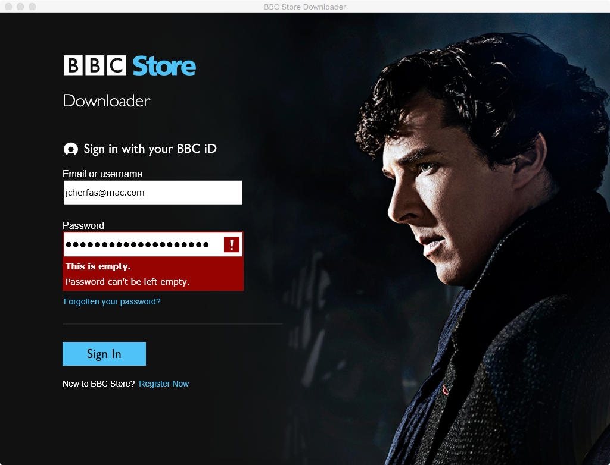

A year or so ago, I stopped pirating TV shows and movies. The whole process just became too fraught, what with finding the torrents, watching out for the bad guys,  and never quite knowing whether the resulting file would even be watchable. Plus, it was becoming easier to watch legitimately. Last night, attempting to watch [London Spy](https://en.wikipedia.org/wiki/London_Spy) from the BBC made me long to dig out my old eye patch.

===

It all looks so seductively easy. Register with the BBC Store, hand over credit card details, and go. But no. You can stream, but to download you need a piece of shite called the BBC Downloader. OK, wait while the Downloader downloads. Try to install. Nope, you need Silverlight. Wait while Silverlight downloads and install that. Try the Downloader again. Infuriatingly, the password field absolutely refuses to accept that there is a password in it. The genuine password. Every time.

 {.center} 

OK, by now I'm losing the will to live. But there's an option to stream, so let's try that. Nope. You need Flash.

Hello, BBC. It's 2016. Even [the New York Times is giving up on Flash](http://open.blogs.nytimes.com/2016/02/08/flash-free-video-in-2016/?_r=0). But heck, I've paid my money and I want to see the bloody show. So we stream, and that goes well until it doesn't. Stuttering, stop-starts, and the final indignity, that I don't have the bandwidth. Listen, mate, I have bandwidth to spare. It's your end, dolt.

This is a farce. No wonder people like me do indeed steal stuff, stuff that we would be happy enough to pay for.

The show, by the way, is excellent, gripping, scary and sufficiently mysterious that I will be willing to go through the whole thing again. Four more times.

P.S. I wish I'd thought to look on iTunes first. My mistake. At least that works, even though there's less in it for Dear Old Auntie.

P.P.S. I'm not even going to touch on geographical restrictions.