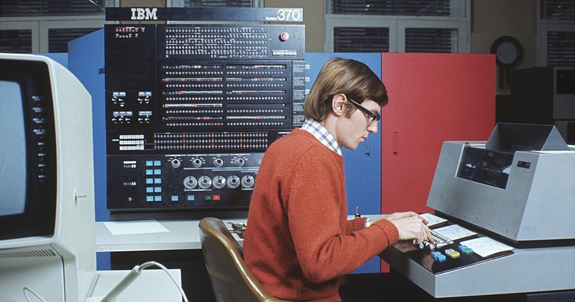

[{.center}](370-large.jpg)

It pains me to admit this, but I am going to give up on my attempts to learn enough javascript to tinker. I just cannot get my head around enough of it. The two things I find most difficult are flow control and flow control. In particular, I just cannot grasp how to obtain some information inside a function and then be able to use it outside the function. Lord knows I've tried, like being back in the bad old days of BASIC and changing one thing at a time until — miracle of miracles — it works. Except that no matter what I have tried, it doesn't work.

===

That awful attitude of letting the machine find the mistakes must have come about after my first encounters with a computer, when I would submit rolls of punched tape or, when it came to printing my thesis, boxes of punched cards, to the priesthood of the IBM 370 in the late afternoon, after a day at the clanking machine. And after I annointed myself into the priesthood of the PDP-12, which still needed punched tape and booking a time slot; you didn’t mess around under those circumstances. You proof-read your code and stepped through it on a piece of paper. 

All of which is a boastful way of saying that I am at least a little bit familiar with fundamental aspects of computer programs, at least as they were 50 years ago.

So it must have started when I got my first personal computer, an Apple ][ E.

Yup, the rot set in then, and it has been downhill ever since. A while ago I did take a course to refresh my memory and solidify my understanding of PHP, and it was great, but even then, I never really got my head around constructs like `this=>that`.

The thing is, I don’t do enough of this stuff. I want to, but I don’t actually have to, and that’s the difference. This latest brush with javascript came about because I would prefer to have a more elegant solution than my customary approach to graphing the time I spend working on various projects. At the moment the data are repeated on every page in which they appear. How cool would it be, I’ve been thinking since forever, to have a single data file and “just” read it into the pages where I need it. But I cannot make that happen.

What I would absolutely love, and might even be prepared to pay for, would be to have a live human being explain some basic ideas to me. There are tons and tons of online tutorials, as I know, but most of them start from a point that is already beyond me. I’ve spent all my spare time over the past three weeks trying to get there from here, and I am finally prepared to admit I cannot do it.

Instead, I’ll devote some time to making the graphs themselves look a little better, in time for a new year of data.

!!! Our punch card machines were definitely not in the same room — or even the same building — as the computer. The image is credited to f8 Imaging/Hulton Archive/Getty Images. I lifted it from [ars technica](https://arstechnica.com/information-technology/2017/03/malware-101-the-cias-dos-and-donts-for-tool-developers/).