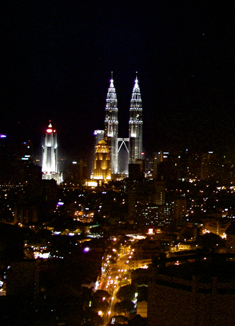

 {.center}

From the 26th floor of the Dynasty Hotel one has a pretty good view of the Kuala Lumpur skyline, and what it looks most like is a scene from the Dan Dare comics of my youth. All that's missing are the personal space vehicles zipping overhead. And the one-eyed babes in purple. 