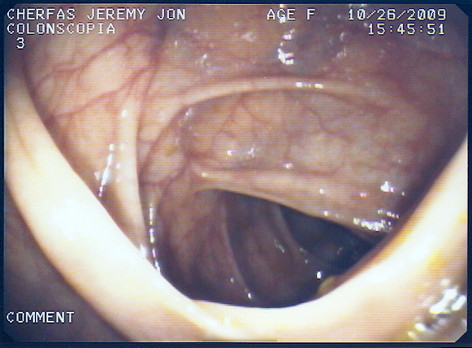

Start: 95.4 Last week: 88.9 This week: 87.0

_Did I really dump almost 2kg in a week? Yes. But it's not quite what you think._

I've been putting off an absolutely routine, age-related procedure for almost a whole year now, put off myself by the necessary preparation and fear of the unknown. Everything I read, [and there's lots of it](http://www.google.it/search?hl=en&client=firefox-a&rls=org.mozilla%3Aen-US%3Aofficial&hs=w5V&q=preparing+for+a+colonoscopy&btnG=Search&aq=0&oq=preparing+for+a+colono), seems to me to be unnecessarily coy about the whole thing. So OK, I know not to drink red juice after the sluice-out, apparently because it can be mistaken for blood. But what to expect of the sluice-out itself? Stay near a toilet and have something to read aren't all that informative. Knowledge is power, and reassurance, and preparedness, and all that, so here's the guide to:

## How to really prepare for a colonoscopy, really

===

First off, there's the two days before the sluice-out. No fruits, no vegetables, no bran, minimal fibre (which I took to mean no bread). That was easy enough, although dull. Fortunately I like plain pasta with oil, even twice a day, and there didn't seem to be any injunction against cheese. Also, yoghurt and honey. Coffee and tea were OK too. Then dawned the day before the day. Starting at 3 pm I was to drink 4 litres of a [solution](http://www.nulytely.com/golytely/) that works by keeping fluid in your large bowel, when one of the main purposes of the bowel is actually to reabsorb fluids. Many preparation sheets warn about its flavour, its tendency to make you "sick to your stomach" and so on, and none tell you how fast it acts, or what to expect; exactly why I was apprehensive. Here, then, is the blow-by-blow:

15:03 Drank the Kool-Aid. Flavoured, not what I expected. A bit sweet. Not great, but still.  

15:21 Half a litre down, three and half to go.  

15:52 Was that a twinge? Nah.  

16:26 Action. And so it begins. Note that well: Almost 90 minutes before **anything** happened.  

17:04 Over the hump intake-wise and just ramping up output-wise. Unlike any diarrhea I can remember. No cramping or anything and a different consistency, a suspension of small bits.  

17:25 Lord but this drinking is boring. They say I can have a liquid diet after this is over, but I'm not sure I'll ever want to drink anything ever again.  

17:54 Two trips in less than five minutes. And I think we're achieving clarity.  

18:19 Half a litre in, half a litre out. That seems fair.  

18:34 Starting in on the final half litre.   

Settling down now, and the whole thing not nearly as bad as I feared. Yes, there were many trips to the bathroom. But hey, that's what is supposed to happen. And, as noted earlier, there really wasn't any pain. In fact the worst of it could probably have been avoided by the use of something softer than our normal paper. By 9.30 pm it was practically over. A glass of apple juice before bed. I really wasn't hungry.

The day itself was the worst, for discomfort and waiting, because you're not allowed to drink for 6 hours before, and I was scheduled for 3 pm. In the end, I went in at about 3.30, and was out cold throughout. Friends have said that I should have stayed awake and watched it on TV, but I'm not sure they offer that in Italy. I did get stills.

Please note; I am not putting a brave face on this or anything. If anything, I'm a coward. But it really is no big deal. And the good news? Clean as a whistle.

 {.center} 

Oh, and the farts afterwards are a total delight.
