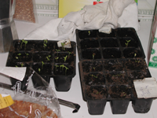

 {.left} I've been doing this almost every single year for the past, oh, 35 years and it never fails to amaze me. You bung the seeds in to damp compost, you keep them a bit warm and -- Bam! -- new life. Keeping a lid on my impatience can be hard, and in my current set-up is especially dangerous because there is nowhere that is both warm and light. A day of neglect results in spindly stems that will never amount to much. But when its right, it is so right, and in this instance is particularly warming because I promised to raise these plants for a friend who, I think, is currently floundering around the Caribbean on a yacht, poor thing. Have fun Joanne, your seeds are safe with me.