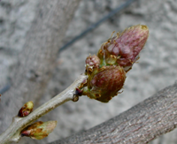

 {.left} While on the subject of spring and seeds, last weekend I went back to the gardens at the Villa D'Este in Tivoli. The connection is simple enough. The Wisteria buds are at that perfect pre-bursting stage when everything about them says "I promise". And back at home, among the germinating seeds are four wisteria beans whose velvety pods I collected on my previous visit. Ten seeds, four rotten, four germinated, two still in abeyance. Not a bad score. And so what if I have to wait 10 years before these too fulfill their promise.

 {.left} This time I remembered my camera and realized in time that I would have to go easy on the batteries if I wanted to get the shot I needed. So here it is. OK, so they aren't by Bellini. But they are most definitely [kitscher than kitsch](../power-gardening/). 

All these pictures raised once again the necessity of a geeky posting about implementing a photo album within Tinderbox. Which is almost done. More of that when it is done. In the meantime, some people noted that this posting originally broke the layout by being too short for its own good. With two pictures, and one of them vertical at that, the copy ended too soon. easy enough to fix by dribbling on for a line or two, which should restore the layout except on the widest screens. But the problem is symptomatic of a wider malaise within my site; the stylesheet was essentially cobbled together a bit at a time and is now in need of a major overhaul. I certainly need to do something before the photoblog can go public. The question is: how much to do?

Explorer is the big problem. It is just so badly behaved. There are fixes, or so I believe. But I'm frankly reluctant to implement them. On the other hand, that reluctance is probably just damaging the experience of this site for the vast majority of users. Maybe I'll have a little play and see how far I can go with a general clean-up, and then try and implement a proper set of filters to put everyone's browser on an equal footing. [^1]

[^1]: Nothing, it seems, ever changes