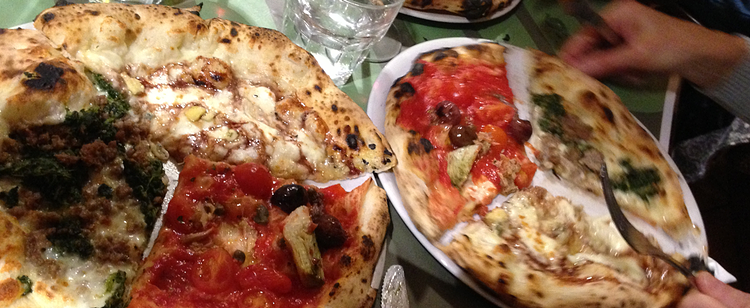

It is difficult to find, and impossible to park once you do, but [Sforno](http://www.sforno.it/) will make it worth your while. I'd heard a bit of buzz about it, but what finally tipped the balance was a [review in Puntarella Rossa](http://www.puntarellarossa.it/2013/01/07/sforno-a-roma-la-pizza-che-non-delude-mai/). OK, she thinks the location is "convenient". Perhaps it is for many; we rounded up some chums and made plans for an expedition.

===

The place itself is utterly charmless, spare in its decor, overpoweringly noisy, and utterly lacking in anything resembling ambience. Which is true off most great restaurants here. What kept it from being utterly abysmal was the lack of a television. But -- Oh! -- the food.

We started with some of the justifiably famous _fritti_. One filled with _'nduja_, one with pumpkin, mozzarella and orange peel, and one with red chicory, _guanciale_ and _caprino_ cheese. Even split three ways, so little more than a couple of bites, each was more sublime than the last. I could live on these (although not for long).

 {.center}

Then the pizzas. The Main Squeeze went for broccoli and sausage meat, our chum for the Sicilian, and I for the Greenwich, a mixture of mozzarella, stilton and a port reduction. And of course we shared like mad. [^fn1]

I gotta say, the Greenwich was my favourite. Next time -- there will be a next time -- it is going to take a monumental effort to give Sforno's famous [caccio e pepe](http://www.puntarellarossa.it/2013/01/07/sforno-a-roma-la-pizza-che-non-delude-mai/) a try. Next time, though, I hope someone else will drive, so that I can sample the extensive beer list.

[^fn1]: La Fucina, be it noted, brings one at a time and you are expected to share, the great benefit being that each pizza is equally hot. 
