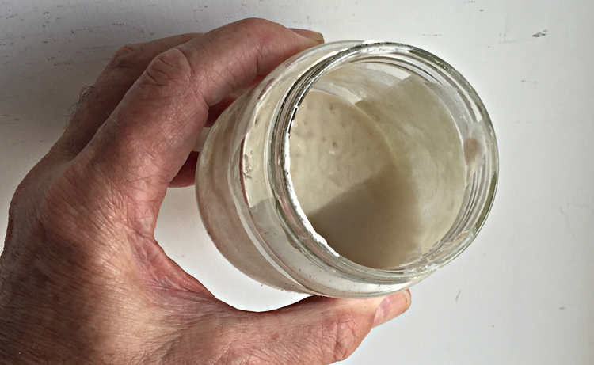
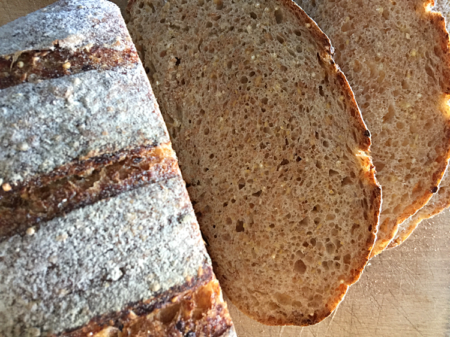

{.center}

Back from almost 6 weeks away (and no inclination to write here) my first order of business was to coax my sourdough leaven back to life. In 36 hours I managed to go from the somewhat smelly jar above to the rather delicious bread below. And I [wrote about it over on Fornacalia](http://www.fornacalia.com/2016/resurrection/), which, like the leaven, has been a little bit neglected of late.

{.center} 