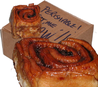

 {.left} It's been a day for memories. First off there was a care package from [Rob](../oranges-are-the-only-fruit/) and Lynn and Ellie back in the UK. Perched among the polystyrene beads were not only two fine videos and a CD, but a box labelled "Perishable! Eat me now!!" And inside that, four Chelsea Buns from Fitzbillies in Cambridge. OK, so they weren't still warm, but they were as sticky as ever and just as toothsome as ever. You can keep your madeleines and scented tea. Biting into a Fitzbillies bun, licking my fingers, and I was back cycling into a fierce Fen wind, racing home with a bag of buns in the basket and an extra one to power me along and Nick and James and whoever waiting with the tea already on and brewing. Or lounging up Downing Street knowing that if I timed things just right I would have a few seconds to rinse my fingers in the cavernous polished brass toilets under the big lecture theatre. I tried to share the joy here in Rome, and people were certainly polite enough, but maybe one has to have had the warm fresh article to fully appreciate the joy in a slightly dryer, but nonetheless very welcome, week-old version. I think I'll have another now with a cup of coffee. And maybe photograph it too. Anyway, grateful thanks to Rob _et al_.

The other stroll down reminiscence road was prompted by a visit to the dentist. I've had an awful pain in the joint of my jaw for past three weeks or so. Having eliminated a tumour of the parotid glands -- which Lord only knows hadn't even crossed my mind -- and just about everything else the otorhinolaryngologist suggested I might be grinding my teeth. "No," said the dentist, "but maybe you are clenching your jaw at night." So I've been fitted with a clear resin bite plate, to wear at night and any other time I can be reasonably sure I won't have to talk to anyone in a hurry.

And the memories? When I was about 15 or 16 I went out with a girl who wore the most complicated braces. They had little rubber bands to keep up the pressure on her teeth. And as we snogged I remember feeling them with my tongue and thinking, "God, this is exciting". Not at all squeamish, just odd and strange and somehow wonderful. And I remembered a girl I went out with whose name was Roots, not short for Ruth, but what was her real name? And her mother was a warm and delightful woman who had an antique stall each week at Bermondsey market. I think. And Roots was tall and slender and very lovely, with long straight brown hair, and I remember more than once walking home at two in the morning from her place in Cricklewood, which was a long way away. And she went to a different school, not the one that boys from my school generally went out with. But here's the thing: I cannot remember whether Roots was the girl with the braces on her teeth. Or was it someone else? And if so, who?