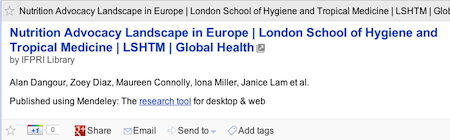
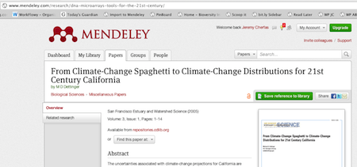
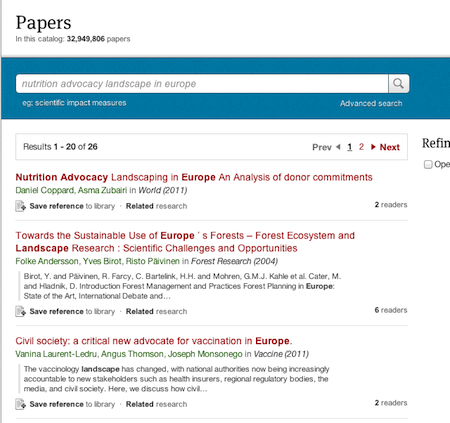
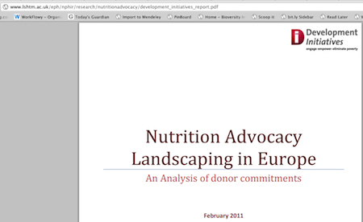
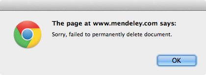

## It's no picnic. Or is it?

I'm impressed with [Mendeley's](http://www.mendeley.com) response to blog posts about it, but I'm not just trolling for comments. Rather, I want help understanding what seems to me to very odd behaviour. So odd, that I took a bunch of screenshots that might help me tell the story.

===

One of the things I like about Mendeley is the social aspect of being able to share papers with a group, and of course that's much easier with an RSS feed of the group's papers, which Mendeley duly supplies, so the information comes to me, rather than me having to remember to go to it. 

When I see something interesting in my RSS reader, I click on it, and it takes me to the paper in the group's collection in Mendeley. At least, that's the plan. But sometimes, it doesn't. So, I see this item in Reader.

{.center} 

I click on the link at the top, and it takes me … here

{.center} 

WTF?

So I use the search facility in Mendeley and it finds the paper -- but with a slightly different title. See that. _Landscaping_, rather than _Landscape_, which was the version in the group's feed.  [^fn1]

{.center} 

And that is indeed the correct paper, which links through to the original PDF at the London School of Hygiene and Tropical Medicine.

{.center} 

At this point, I'm wondering; what's the problem? Could it be a [picnic](http://en.wikipedia.org/wiki/User_error)? [^fn2] And if so, where is the chair; in the group, or at Mendeley HQ?

To see if I could find out, I created a feed for [our own group](http://www.mendeley.com/groups/1431283/brainfood-agrobiodiversity/papers/), the one that offers readers at the other place easy access to the papers we select as [Brainfood](http://agro.biodiver.se/category/brainfood/). The first week, that didn't seem to have the same issues, which suggested perhaps the problem's chair was at IFPRI. But this morning, after updating our group, I discovered from the RSS feed that Mendeley simply had no knowledge of a couple of the links. Faulty metadata seemed to be the problem. Instead of sucking the metadata correctly from the publisher's website, as I believe it had done every time before, Mendeley had appended the DOI and journal name to the title, and somehow the RSS feed got mangled. I suppose I should have noticed, but I didn't see anything wrong with the titles at the time. And I did later discover a quick work-around; hover over the link in Reader and look at the URL; if it looks odd, it is almost certainly bust.

Anyway, when I noticed the problem, I rushed back to My Library and corrected the metadata by hand. (Did I mention that I care about this sort of thing?) Blow me if the old versions didn't hang around in the group's library. I had to re-add the correct versions from my library. And then, of course, I had two versions of each in the group library. Can you simply select one and delete? Can you buggery! 

{.center} 

I had to open the desktop application, sync, find the errant papers, delete them, and resync. That did it.

The big question I am asking myself (quite apart from whether anyone cares) is whether all this faff is worth the effort. There are other places that allow me to save and share papers. I'm not going to maintain more systems than I really need to. Perhaps I should just draw a veil over Mendeley ...

[^fn1]: I note, in passing, that the metadata for the paper is incorrect, but that's old news. 

[^fn2]: Problem In Chair, Not In Computer; far and away my preferred acronym for this particular user error. 