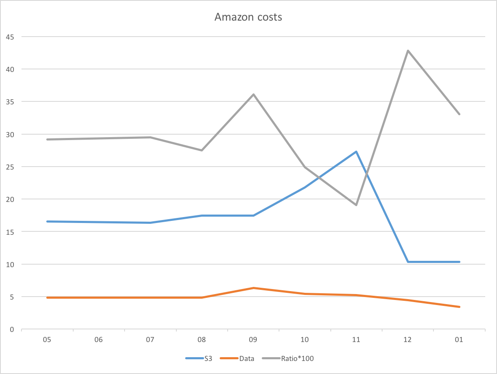

Amazon Web Services has been my main depot for storing and serving online information. It is where all my podcasts live and where, for a long time, my offsite backups lived too.

Back in March last year I upgraded my DropBox plan to give me 1TB of storage. It was just a lot easier than juggling several different places to keep below freemium levels. And then, as the year wore on, I began to think that the price I was paying to keep backups at Amazon, even reduced by moving some things to the cheaper Glacier storage, was becoming a bit much at $25-30 a month. Of course, I didn't really know how much of that was backups and how much was serving the podcast. Nevertheless, it seemed worth exploring alternatives, and so in November I decided to shift my main offsite backup to DropBox. It took forever, of course, but once done there's no discernible difference to S3.

Now, having used DropBox for backup for a couple of months, I thought it would be interesting to look at my Amazon costs.

{.center}

This shows clearly that the S3 storage costs (the blue line) are lower for December and January. The data transfer costs (orange line) seem to be dropping too. What intrigues me now is the ratio between the two, the silver line. [^1]

[^1]: No, this is not an homage to the DC metro. It just turned out that way.

My guess is that this reflects the number of downloads of the podcasts, although I have no way (that I know of) of being sure about that. And it looks like it may be moving to a higher level. Too soon to tell for sure, but with the eye of faith ...

I wonder how things would look if I added the download stats to the graph?