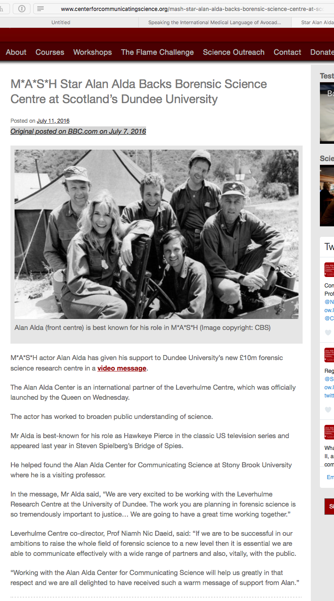
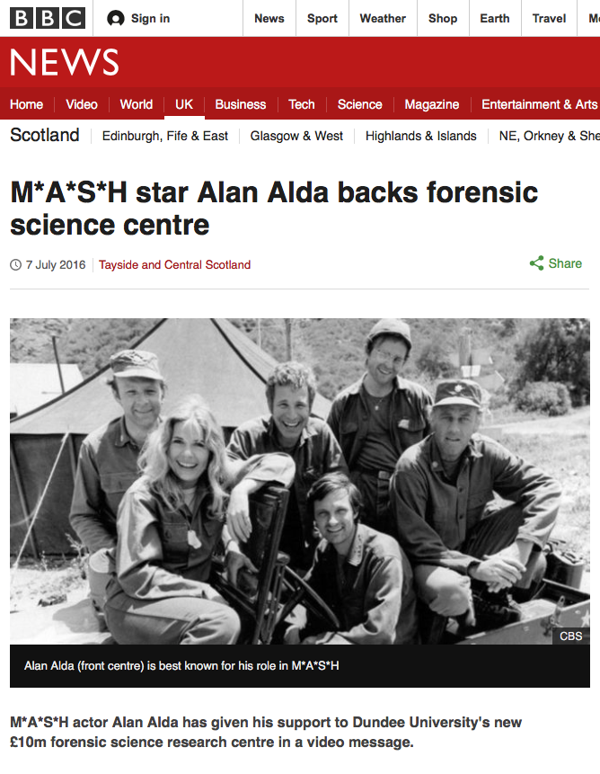

I have to believe that nobody at the Alan Alda Center for Communicating Science has actually looked at the site since 11 July. Either that, or [this headline is a joke](http://www.centerforcommunicatingscience.org/mash-star-backs-borensic-science-centre-at-scotlands-dundee-university/) to which I am not privy.

{.center} 

Also interesting, [the original on the BBC website](http://www.bbc.com/news/uk-scotland-tayside-central-36734799), credited by the AACCS, has no such error, and is shorter.

{.center} 

So maybe it is a joke.

