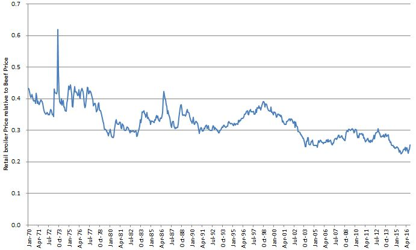

Maybe you saw the recent story that a Thanksgiving dinner for 10 this year would cost $49.87, down on last year’s $50.11. 

Once I’d picked myself off the floor at that price, which ignores the cost and time of preparation, not to mention potential family _sturm und drang_, I discovered that the main reason for the drop is that turkey is cheaper than ever. In fact, according to [NPR’s version of the story][npr], the US Bureau of Labor Statistics said "October marked the 14th consecutive month of decline for eggs, meats, poultry and fish indexes".

Which makes the New York Times' claim that [You Might Be Paying Too Much for Your Chicken][nytimes] somewhat fishy.

===

Jayson Lusk, an agricultural economist, pushed back at one particular claim of that article, that while beef and pork prices had fallen over the past several months, the result mainly of cheaper feed, chicken prices had remained stable. Lusk [plotted the price of chicken against that of pork and beef][jaysonlusk] and concluded, first, that:

> As of September, the ratio of chicken to pork prices is essentially flat (i.e., chicken isn't getting more expensive relative to pork). While chicken is a tad more expensive than beef in August and September relative to July, overall the trend looks pretty flat to me.

That seems to put paid to the idea that chicken prices are rising relative to pork and beef. But the real thrust of the story in the New York Times is that some of the indices used to set the price of chicken -- which largely determine how much people end up paying -- have diverged pretty widely recently. One benchmark price has fallen 5% over the past 18 months, while another has fallen 33%, and because most supermarkets use the former to determine how much they'll pay for chicken, shoppers have ended up paying more than they should.

The story is really complicated, and there's some fine additional reporting at the [Washington Post][washingtonpost]. It may be true, as the Post article seems to suggest, that the chicken producers -- and very few of them are responsible for almost all the chicken sold -- have indeed found a way to inflate "their" index price. 

One food product supplier, Maplevale Farms, certainly thinks so. In September it launched a lawsuit against several big producers, alleging that since 2008 they had "systematically colluded ... to fix prices in the broiler-chicken market". Individual consumers have also sued the big producers, and the market seems wary, with share prices falling and brokers recommending that people sell.

All of which is interesting and may well be costing ordinary people money, though perhaps less than the [Libor scandal][wiki]. But it is also, and not just to me, more or less besides the point. Jason Lusk's second conclusion from his comparison of chicken prices with pork and beef is:

> Chicken is really cheap! It is about half the price of pork and about a third the price of beef.

{.center} 

Lusk helpfully also presents the long-term comparison of chicken with beef,[^2] and notes that "chicken has progressively gotten cheaper relative to beef". And, I would add, relative to just about every other form of protein too. [^1]

[^1]: I am wondering, though, why chicken shot up relative to beef in Q4'73. Oil prices, probably. Maybe chicken needs more oil than beef, at least short-term, because generation times are so short.

[^2]: Which I have taken the liberty of reproducing above. I hope that's OK; saves me having to find, download and plot the data myself.

To me, that's the fundamental problem of not just the chicken industry but almost all food production these days. The drive for ever lower costs (and higher profits?) wrecks everything.

Oh, and guess what happens to those cheap Thanksgiving turkeys?

> [T]he Natural Resources Defense Council ... estimates 204 million pounds of turkey will get thrown away over this Thanksgiving holiday period. The group notes that those scrapped leftovers use up many resources, from water to energy.

> The group offers this recommendation: "Buy less than you think. If you're hosting anything like the average Thanksgiving dinner for 10, almost a third of that dinner will go to waste this year."

[npr]: http://www.npr.org/sections/thesalt/2016/11/17/502449964/thanksgiving-dinner-is-getting-cheaper-as-grocery-prices-fall-again?utm_medium=RSS&utm_campaign=thesalt
[wiki]: https://en.wikipedia.org/wiki/Libor_scandal
[jaysonlusk]: http://jaysonlusk.com/blog/2016/11/4/chicken-price-manipulation
[nytimes]: http://www.nytimes.com/2016/11/04/business/maybe-paying-too-much-for-chicken.html
[washingtonpost]: https://www.washingtonpost.com/news/wonk/wp/2016/11/17/internal-document-supports-argument-that-u-s-chicken-prices-have-been-artificially-inflated-for-years/