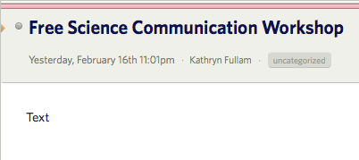
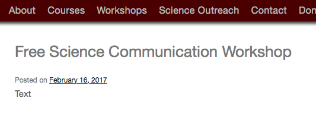

Tom Lehrer, in the introduction to one of his songs, possibly _National Brotherhood Week_, complains that the only thing worse than people who say they can't communicate is that they won't shut up about it. The other side of that coin is that people who claim to be ace communicators make themselves hostages to fortune.

When I saw this little gem in my reader, I though, nah, it must be an error in the feed.

===

{.center} 

Being the diligent type, and also scenting that warm hostage blood, I scurried over to the website, just in case. 'Zact same thing!

{.center} 

Not that it ever makes any difference to [the folks concerned,](https://www.jeremycherfas.net/blog/shurely-shome-mishtake) but it does gladden my black heart to point out their occasional lapses.