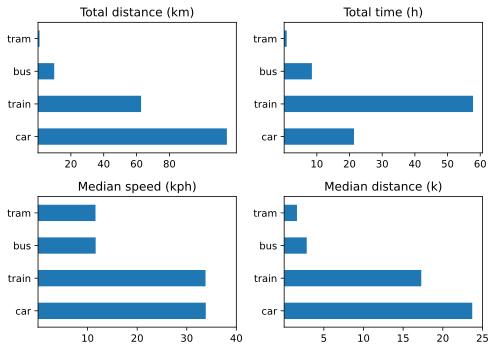

## Moving forward

For ages now I have tracked myself through space using a variety of apps on my phone. The most thorough is undoubtedly [Wanderings](https://wanderin.gs/), which since January 2018 has stored my location and can display it all as a heat map. I don't need the heat map to tell me I have hardly been anywhere this past year.

Another app, [Overland](https://github.com/aaronpk/Overland-iOS), stores a whole lot more data about where I am, what I am doing, the state of my phone’s battery etc. etc. That too will show me a map of where I’ve been, and it also can record trips by specific modes of transport. Halfway through the year I started to use that in earnest, trying my best to remember to start and stop recording the trip whenever I wasn’t just walking about. Those data proved extremely handy as I tried to teach myself Python through the year, because a project that actually means something to me works a lot better for me than any dataset chosen by someone else.

So far, making use of the actual location data has been frustrating, although I mean to continue. Descriptive stats proved a lot easier to grasp and to work with. Here, then, are stats for all trips I recorded this year.

|||**Distance** (km)||**Speed** (kph)||
|**Mode**|Number|Mean|Median|Mean|Median|
|-:|:-:|:-:|:-:|:-:|:-:|:-:|
|Bicycle|1   |2.2|2.8   |15.8   | 15.8
|Plane|2   |646.8|646.8   |328.0   | 328.0
|Walk|3   |21.3   |4.0|4.0|   5.5
|Tram|5   |1.8|1.61   |12.2   |11.6
|Train|8   |78.4|172.8   |29.0   |33.8
|Car|14   |82.1|23.7   |36.6   |33.8
|Bus|23   |4.3|2.8   |12.1   |11.6

A few things of note:
- The single bicycle trip was on an e-bike.
- The walks were an experiment. I do not generally record walking.
- Distributions for train and car are markedly skewed, a few longer trips, many more shorter ones.

For further analysis, I decided to focus on only those modes of transport that I used more than three times. Making pretty pictures, as you see here, was more about learning to do so than about the extra insights that it would provide.

{.center}

Still, I find it interesting that we travelled much further by car than by train, and although median speeds were roughly equal, we spent far more time on train journeys than car journeys, probably because I counted waiting to change trains as part of the same trip.

Overall, though, I regard these data as a kind of baseline for future years. I don’t anticipate getting rid of the car just yet; it is too convenient for spontaneous out-of-town trips, but we barely use it in town. A total distance of 1150 km is not excessive. I need to ride my bikes more.
