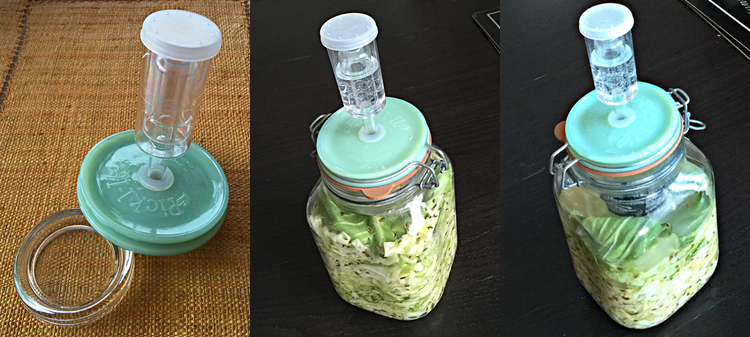

One of the trickier aspects of home fermentation is the need to keep things anaerobic. The bacteria that do the work are perfectly happy without oxygen. Most spoiler moulds and bacteria need a bit of oxygen. So the usual advice is to ensure that all the stuff you're pickling is submerged beneath the liquid in which it is being pickled. Easy enough in a nice, straight-sided pickling crock, where a plate with a weight on top does the job smoothly. Posh crocks may have a fitted lid or even an air-lock. But they're expensive and second-hand ones are hard to find.

===

As as result, I've been doing most of my pickling in glass jars designed for home canning, and because they have a narrower neck and a shoulder, keeping stuff submerged isn't easy. I put a plastic bag in the neck of the jar, fill it with water (mercury would be so much better) and try my best to push the bag full of water into the space above the stuff. It works, but not perfectly, and it is, to be honest, a bit of a pain.

So I was thrilled to discover (and I wish I had made a note of where) a company called [pickl-it](http://www.pickl-it.com/). They make glass lids that fit my canning jars. But these lids are special; they contain a hole, with a silicone grommet, into which you can push a little plastic airlock, like the ones brewers use. They also make a nice bit of round glass to keep things submerged.

I ordered them. They arrived. I made sauerkraut.

 {.center}

I'm still improvising though, because the little bit of round glass isn't actually heavy enough to keep the cabbage submerged, especially in the early days when there isn't much liquid. So I put a little espresso cup between the lid and the round bit of glass to push down on the cabbage-leaf cap for the sauerkraut. Five days later, when the salt had drawn much more liquid out of the cabbage, I replaced the espresso cup with an empty mustard jar to push down even further. And now it is all bubbling away.

These things aren't cheap by any means, but I think they are going to be very useful.

P.s. 1 November 2015: I just tasted it; fantastically good. And in just 10 days. It has been warm, which could account for the speed, but I also like to think that the new equipment provided a better environment for a good fermentation. Now I just need to find some raw bettroot in the market for some beetroot and turnip. There are lots of green beans about too.