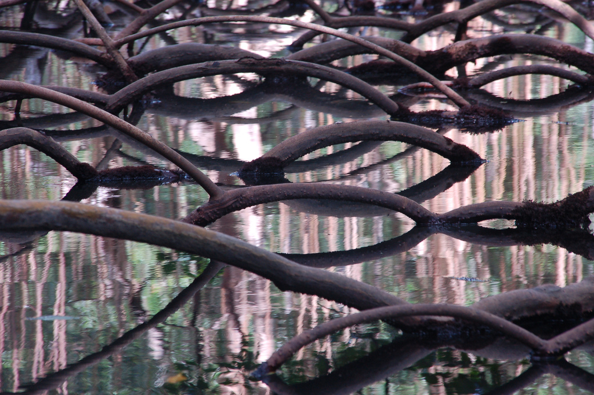

 {.center} 

Marcellino over at Biopolitical [skewers](http://biopolitical.blogspot.com/2007/03/mangroves-local-communities-and.html) a well-meaning environmental economist for wanting local "ownership" of a resource only if that ownership delivers the ecologically desirable result. Edward B. Barbier [discusses at length](http://www.esa.org/esablog/?p=28) proposals surrounding support for replanting mangroves to protect against coastal disasters. Barbier identifies the value of mangroves and the factors that make it worthwhile to destroy them, and comes up with a package of policy measures that he thinks would promote replanting of mangroves. Ownership of some form is an integral part of Barbier's solution, but he sets conditions, and that's what annoys Biopolitical.

===

Barbier writes:

> [T]he decision to allow such local management efforts should be based on the capability of communities to effectively enforce their local rules and manage the forest to prevent over-utilization, degradation and conversion to other land uses.

At which Biopolitical points out:

> Barbier wants local management of mangroves as long as it leads to Barbier's preferred use of the mangroves.

Which is all fine and dandy and an entertaining part of the flickering stiletto-work that characterizes a good academic scuffle. For me, the bigger issue is why none of the players -- states, corporations, communities, individuals -- are capable of coming to the sane long-term conclusion.

It's all down to discount rates, of course, and externalities. And, funnily enough, I was thinking those exact same thoughts earlier today as I read a post over on Aaron Swartz's [Raw Thought](http://www.aaronsw.com/weblog/nobodyshops), where he reviews a book about game theory and economics. As I commented there, all the big sources of profit in the world seem to be the result of playing Garrett Hardin's [CCPP game](http://www.garretthardinsociety.org/articles/art_who_benefits_who_pays.html).

Hardin is best known for "The Tragedy of the Commons" which ought to have been called the Tragedy of the Mismanaged Commons, because there is nothing inherently wrong with a commons. Just that the mechanisms for controlling how individuals (and individual corporations) make use of them have more or less completely broken down.

I happen to think Hardin was one of the world's great original thinkers who, alas, continues to be ignored.

----------

* [Mangrove](http://www.flickr.com/photos/18555810@N00/407090285/) picture by [djembali](http://www.flickr.com/photos/18555810@N00/) used under a Creative Commons licence
* How nice to discover that not one of these links had rotted away. Especially not Aaron's.