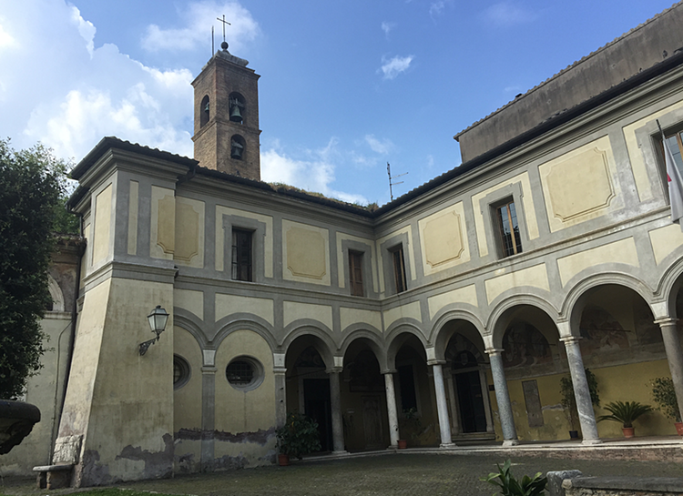
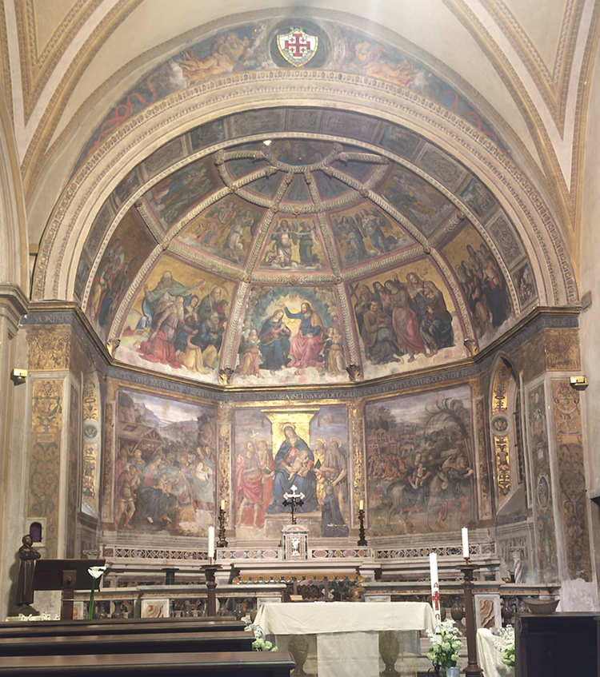
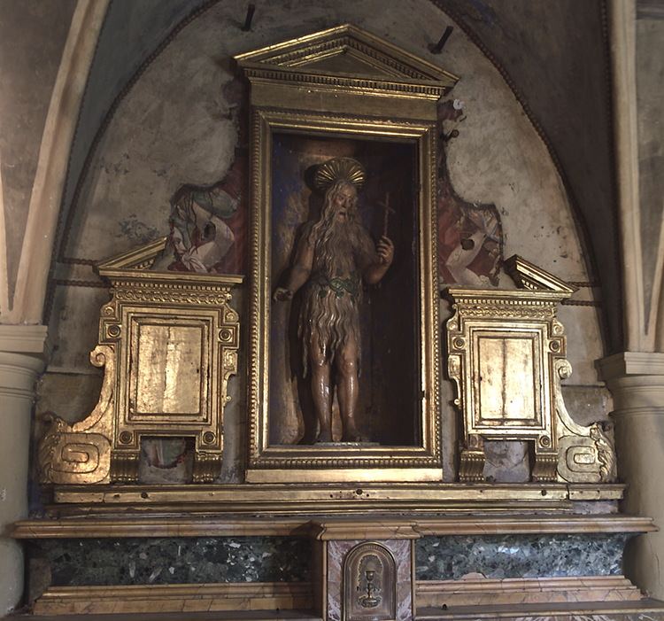
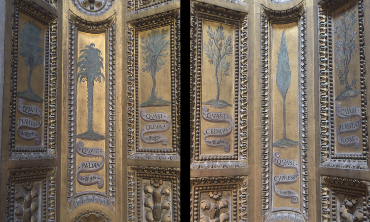
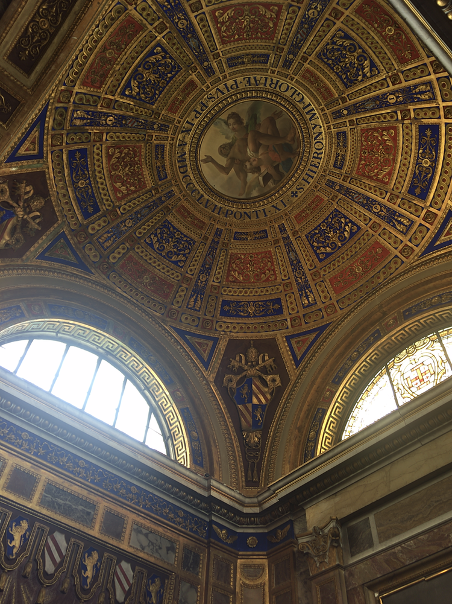
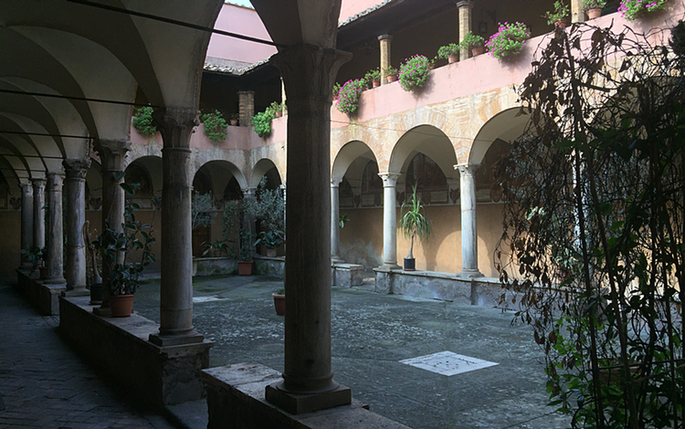
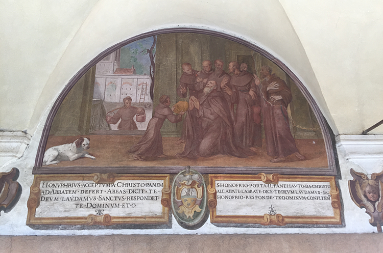
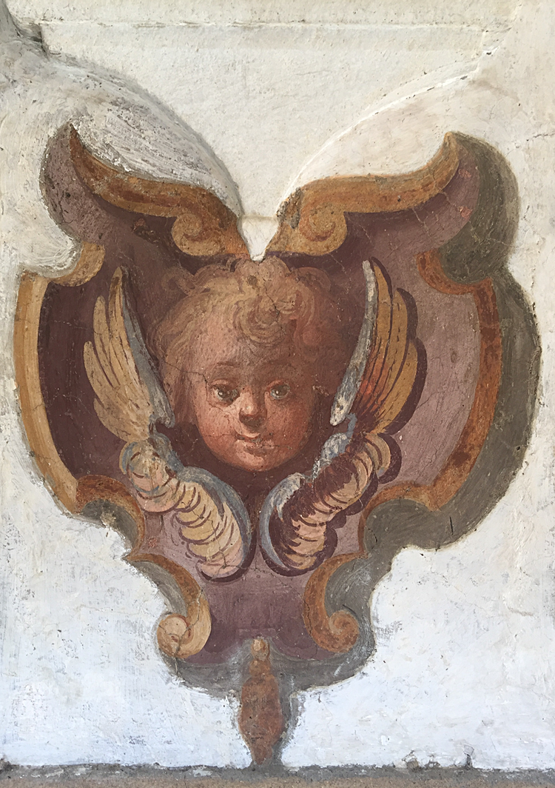

It being Easter Sunday, The Main Squeeze suggested a walk across the top of Trastevere to visit the church of Saint Onofrio. He's the one who has amazingly long hair that clothes him and keeps him warm (and decent), and I've always had a soft spot for him. The church, I was sure I'd seen; although a little dull it seemed a good idea for a destination.

I was wrong. The church I thought I knew as Sant'Onofrio isn't, and the actual Sant'Onofrio al Gianicolo is breathtakingly lovely. I snapped a few pictures as an aide-memoire[^1] but the overall feeling I came away with was that I had wasted far too much time passing this place by, stuck within the unlovely Bambin' Gesu hospital and always beset by chaos. 

===

[^1]: Notwithstanding Sally Mann's point that when you have a photograph, it some replaces memory and robs the recollection.

 {.center} 

The outside is pretty nice, with a lovely little fountain and, despite being just above the traffic, is quiet.

{.center} 

The interior is absolutely sumptuous, with a highly decorated apse and very interesting side chapels.

{.center} 

One houses a statue of the hairy saint himself.

{.center} 

Another a fine painting of the Madonna di Loreto, occupant of the flying house, along with some charming botanical illustrations. I'm not sure what "quasi" means in this context, or why these paintings here, but the whole effect is charming.

{.center} 

In a side chapel that holds a monument to the poet Torquato Tasso, who ended his days here, there's a wildly decorated dome that honours the Hieronymites (followers of St Jerome) who had a cloistered monastery on the site.

{.center} 

And what a cloister. The plants are a little ragged, but who cares? In lunettes around the walls are scenes from the saint's life, starting with the King of Persia declaring he wanted a son and ending with that son's dead body left in a crack in the rocks by Paphnutius the Ascetic, who found Onofrio in the desert. Beneath each fresco is a caption, in Latin and early Italian, telling you what's going on.

{.center} 

The story is complicated, with the infant Onofrio tested in the fire, Satan having suggested to his father that he might be the fruit of an adulterous liaison, and that if he is, he will not survive the fire. In a monastery, an apparition of Jesus gives him bread (if I read that right), which echoes the angel that brings him the host each week during his years in the desert. There's a white hind who for three years nourishes the young man with her milk, and in the desert a miraculous palm that feeds him for thirty years. 

{.center} 

I'm not going to bother linking to Wikipedia, which in this case seems to be missing most of the delights I found at the church, but [there is a lot of information here](http://www.romeartlover.it/Vasi123a.htm). All in all, a wonderful Easter morning. Well worth getting thoroughly soaked on the way home.

If you're in Rome, don't be a chump like me; go and visit.