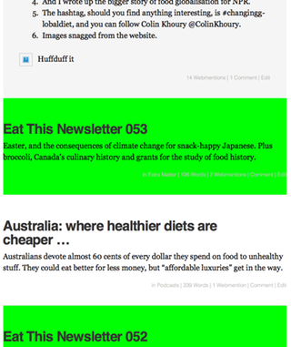

*Tl;dr I did a silly little thing in WordPress that made me happy.*

===

For a while now I've been stumbling towards tidying up my various online presences and trying to make them more compliant with indieweb principles. The latest to get the treatment is the podcast site, which runs on WordPress.[^1] First steps were to generally indiewebify the place, and that is working pretty well. I can send posts out to silos like Twitter and Facebook and receive back comments and other reactions. It really wasn't that hard, thanks to some excellent resources provided by stalwarts of the indieweb community. There are plugins that work and [guides on how to make the best of them][indieweb] and it really isn't that difficult. Confusing, yes, but [help is often at hand][indieweb 2].

The problem, of course, is that having done the needful, I wasn't entirely happy with the way the site looked. The plugin developers certainly can't cater to everyone's needs, and I was quite happy to dive right in and see if I could bend the presentation to my will. But when I did so, things seemed a lot more complicated than I was used to. I started to weigh my options. Go into my old theme and tidy it up, or move to an indieweb-ready theme and start more or less from fresh? 

At first, fixing the old theme seemed a better idea than dealing with all the minor annoyances that a new theme would surely bring. But then I took a look at that old theme, and discovered that the designer hadn't touched it for more than two years and had probably left it for dead. I was stuck with a motherless child theme. I steeled myself to abandon the orphan, but not publically.

Taking a look at the currently available indieweb-compatible themes I decided to work on [Independent Publisher][independentpublisher]. It's nice and clean, seems to have a little ongoing development, and handled my existing posts with aplomb. But I still wasn't satisfied. 

I want different kinds of post to **look** different, but not in the way that WordPress (and most theme designers) interpret that. WP has this nice facility for creating a kind of post identity, for things like standard posts, asides, status updates, videos and all that. And many themes display them differently. My posts however, differ along another dimension. All are effectively articles, but some are podcast posts, some are newsletter posts and some are article posts.[^2] I want a way to make them look slightly different, especially when presented jumbled up on the home page or as search results.

[^1]: I'm not linking to it from here because not a lot has changed yet. But it will. It will.

[^2]: In future, if all goes well, I can imagine there being some of the other post formats that WP expects, but not at the moment.

One thing I've learned from hanging around in indieweb discussions is that things I had always associated purely with display, such as CSS classes, can be used to identify the various parts of a web page. I also know roughly how to use CSS selectors to make certain parts of a web page look different. But as all my posts currently have standard post format and I don't like the way the theme displays other formats, there's no point trying to use the built in formats. That would mean rewriting the entire theme template.. So, what I needed to do was to add an extra class to some posts so that I can make them look different.

Fortunately, just a couple of days ago, Colin Walker had described doing something a bit like that in his post  [Sending likes and replies using custom fields][colinwalker]. That provided some inspiration and some motivation. Based on Colin's work, I managed to create a function that added something to the content of the post, and that was when I realised I was going about it all wrong.

I needed to focus on the WP function `post_classes()`, which already contains much of the meta-information about a post. An hour or so of reading later, and I was ready to try again, greatly helped by Fränk Klein's [Mastering the post_class() Function][themeshaper]. Combining what I learned there and what I learned from Colin, I was able to build a function that did exactly what I needed. Here it is:

````
function my_post_style( $classes ) {
	$id = get_the_ID();
	$my_post_style = get_post_meta($id, 'post_style' , true);
	$classes[] = $my_post_style;
    return $classes;
}
add_filter( 'post_class', 'my_post_style' );
````
----

{.left} Yes, it is trivially simple. I added a custom field called `post_style` and the function just adds the value of that to post_classes. And it worked. First Time. I know because I always use `background-color: lime;` to check that I am where where I want to be.

So that's a major nut cracked. Now all I have to do is style those suckers, do a bit more tidying up and launch the new design. [Autonomy, mastery and purpose][danpink]; it's all I really need to produce implausible amounts of joy.

[colinwalker]: https://colinwalker.blog/2017/04/25/sending-likes-and-replies-using-custom-fields/
[danpink]: http://www.danpink.com/books/drive/
[independentpublisher]: http://independentpublisher.me
[indieweb]: https://indieweb.org/Getting_Started_on_WordPress
[indieweb 2]: https://indieweb.org/discuss
[themeshaper]: https://themeshaper.com/2014/11/20/mastering-the-post_class-function/