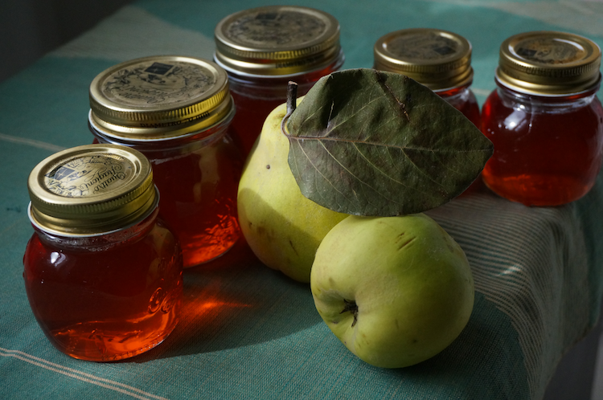
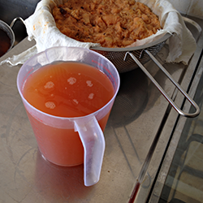

{.center} 

Cooking, they say, is a matter of transformation, and of all the transformations perhaps the most magical is that of quince. A hard, off-white, barely edible hunk of mouth-puckeringness turns deep blush, fragrant and flavoursome. Absolute magic. Take it a step further -- by straining off the juice and boiling briefly with some sugar, and the transformation is complete. I defy anyone who doesn't already know to connect quince jelly with the fruit from which it comes.

===

A hard and fast recipe isn't easy to find; there are lots of variations, several of which I plundered to come up with a quintessential version.

Take a load of quinces -- I started with something in excess of 2 kgs -- halve and then quarter them and toss them into a large pan. Cover with about 2 cms of water, bring to the boil and simmer for an hour to an hour and a half. Give them a good stir from time to time, as quince has an awful tendency to stick to the bottom of the pan and burn. They should be quite soft and pulpy, and surprisingly pink, but well before that you will notice the floral fragrance wafting from your steamy kitchen. 

Crush the pulp in the pan, using a potato masher or a clean bottle or something. Add water if you need. You are aiming for a consistency a bit more watery than apple sauce.

Set up your juice extraction procedure. I use two layers of cheesecloth to line a colander, which sits nicely above another pan. You may have a proper jelly bag, for all I know. Allow the pulp to sit, dripping its juices, undisturbed, preferably overnight. Do not be tempted to squeeze the pulp to extract more juice. That will force particles through the strainer, which will make the jelly cloudy.

{.left} Next morning, or when you're ready, measure the juice, and don't worry that it is cloudy. You need about 7/8ths as much sugar as juice, by volume, according to the recipes I looked at, which is daft, but there you go. After a flurry of converting volumes to weight, I figured that about 1150 ml of juice needed 850 gm of sugar. Some traditionalists swear [you have to warm the sugar first](http://www.eatthispodcast.com/jam-tomorrow/); I didn't. Just poured it into a clean, smaller pan with the juice, although I did stir constantly over a lowish flame until all the sugar had dissolved.

Prepare the jars, washing well, rinsing, and then drying them and at least partly sterilising them in a hot oven while the syrup boils. Once the syrup is boiling nicely it will form a scummy foam; skim that off, if you can. And put a small plate or saucer into the freezer, to test for set. As the syrup boils, the magic of pectin and acid is happening, creating the molecular mesh that traps water and gives you a quivering jelly rather than a pourable syrup or a solid brick. When you start testing for the elusive set is a matter of experience. A thermometer can help; I let the temperature get up around the 105°C mark. Take a teaspoonful of the syrup, take the plate out of the freezer, pour the syrup onto the cold plate and wait a few seconds. Now, try pushing at the syrup with a finger. If it kind of bunches up and wrinkles in front of your finger, it's ready. If your finger just gets wet and slides through the syrup, it isn't. Lick your finger, put the plate back in the freezer, and boil the syrup for another two minutes before testing it again.

Take the jars out of the oven. Use a funnel, if you like, and pour the syrup into the jars carefully; that stuff is hot. Seal the jars. I use lids, rather than the wet cellophane and rubber bands beloved by generations of British jam makers. I also don't make half jars. Any leftover goes straight into a bowl to be enjoyed as soon as it is cool.

If the jars have sealed properly, they'll store without spoiling in a cool place. Once opened, I keep them in the fridge.

And every time I have a spoonful, usually in yoghurt or on toast, I marvel at the minor miracle of transformation that it represents.