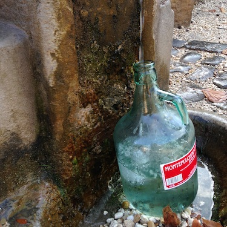

{.left}Last night, we came home to a burst water main and the street awash. This morning, the street below was dry and so were the taps in the house. Luckily, there was enough old water in the kettle for a cup of tea each (though not the customary two) or else we'd probably be lying there still, parched. Taking the dog out, therefore, I loaded my backpack with an empty 5-litre demijohn and set off.

===

Luckily, I don't have far to go. One of the joys of Rome is that it is studded with _nasone_, public fountains that gush delicious, drinkable water. Romans (and ex-pats) will debate the merits of different fountains -- this one is sweeter than that -- but this morning I just went to the one in the park, and having emptied the dog, filled the jug.

I'm therefore declaring solidarity with the women of the world who have to go far further and carry far more, far more often. 

I had hoped that the informal exchange of information around the water source, which I'm told is one of the benefits of having to collect and carry water from a well, would tell me what had happened to the water main and when it might be fixed. But there was noone else there.