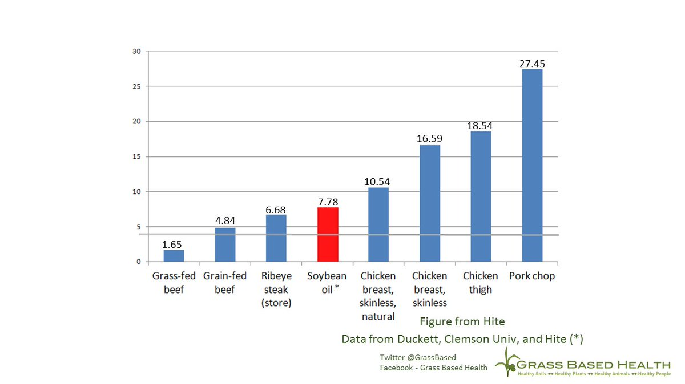

The idea of eating more of something because it contains some miracle active ingredient is a pointless waste of time. For one thing, it further medicalises our whole view of diet and health and plays into the hands of the supplement wallahs. For another, it denies the pleasures of eating a diverse diet. Nevertheless, people do push the better-for-you-because-it-contains-more ... line a lot. Like the person who [tweeted](https://twitter.com/CharlesSpillane/status/375151916566999040):

{.center} 

Yup, patients. Because apparently it has some effect on mice with a "cancer-prevention" gene knocked out. But I digress.

Grass-fed beef is one of the foods for which a health claim is made, namely that it contains more omega-3 fatty acids than feed-lot beef, and that the ratio of omega-3 to omega-6 is better. That claim was part of my [recent interview with Ari LeVaux](http://www.eatthispodcast.com/whats-the-beef-with-frozen-meat/), on why well-frozen grass-fed beef is a better proposition than fresh feed-lot beef. So I was very surprised to see Seth Roberts claim that [grass-fed beef is irrelevant](http://blog.sethroberts.net/2013/09/01/the-irrelevance-of-grass-fed-beef-ancestral-health-symposium-2013/).

> For practical purposes, grass-fed and grain-fed beef are the same in terms of omega-3 and omega-6. 

The graph accompanying that post does show that, per portion, the amount of omega-3 **and** omega-6 is pretty low compared to other kinds of flesh, so perhaps, indeed, one should eat less chicken rather than more grass-fed beef. However, as I said in my post, and as many commenters at Seth's website pointed out, there are plenty of better reasons for favouring grass-fed beef than its nutritional qualities. It tastes better. And it is better for the livestock and for the environment.

*P.s. 11 May 2017: Good to see that Seth Roberts' site is still up, and long may that continue. But where's that graph? Alas, the person from whom Seth got it has been overtaken by spam, although he says it's just [cobwebs](https://twitter.com/GrassBased/status/862670517051957249). Thanks to Peter Ballerstedt for letting me have a copy of that graph.*

[{.center} ](/blog/grass-fed-beef-is-not-irrelevant/Omegas.jpg)