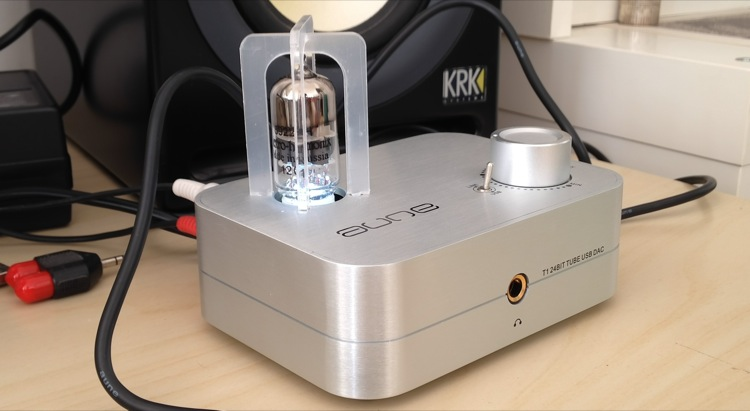

{.center} 

My latest toy is giving me a great deal of pleasure. It is a tube DAC, made by Aune, a Chinese manufacturer. [^1] I'd read a bit about digital-to-analog converters here and there, and always figured that my all-knowing iMac could handle all my audio needs. Then I read a couple of [reviews](http://www.head-fi.org/t/633006/aune-t1-usb-tube-dac-amp-discussion-thread-see-first-post-for-faq) of the Aune T1 that made it seem unmissable, and at the same time got involved in a group buy. So, you know, what the heck?

===

I'm honestly no audiophile, though I love listening to music, and I have a pair of KRK Rokit5 active speakers because I also edit sound, and the iMac's speakers just aren't up to the job. So I wasn't sure what to expect from the dedicated outboard DAC, and it just knocked me flat. Because I'm no audiophile I don't really have the words to describe it. Mostly, I'm hearing detail that I just didn't hear before, especially in quieter passages. Maybe vocals are a bit "warmer," although I'm not even sure what that means. Easier to listen to, that's my overall verdict.

There are some oddities. The utterly lovely knob controls volume only in the headphones, not in the speakers. And when you plug in headphones, it doesn't cut the speakers out, as I had expected. I can live with both of those "faults".

Over among the people who **are** audiophiles, much of the talk is about the differences between different tubes. Not sure I'd ever be able to hear that, but I am worrying now lest my one and only tube pack up and I don't have a spare.

[^1]: I'm not linking to the site because it is kinda pointless. You'll find one easily if you want one.

*11 May 2017: The darned thing went belly up a few months later, crazy hum that I could not eliminate. Its pretty tube is gathering dust.* 