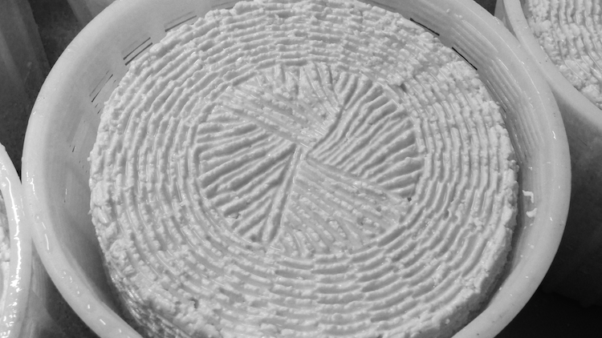
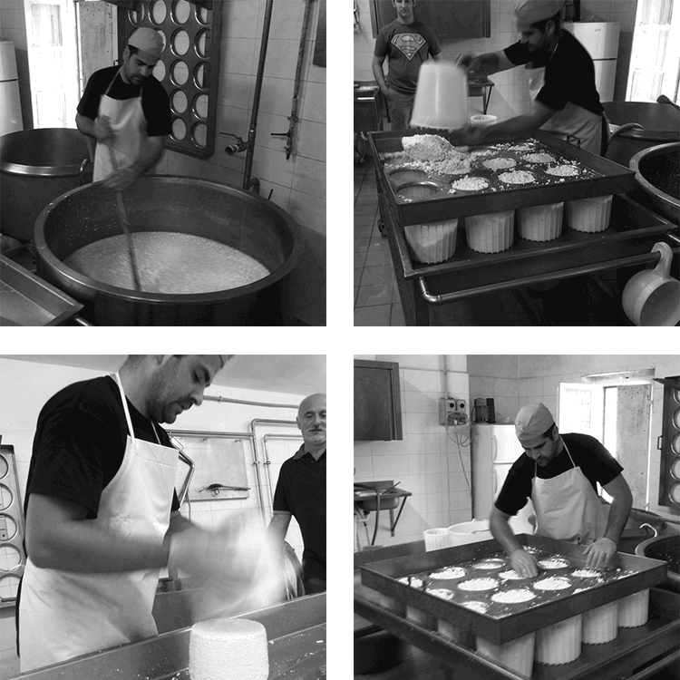
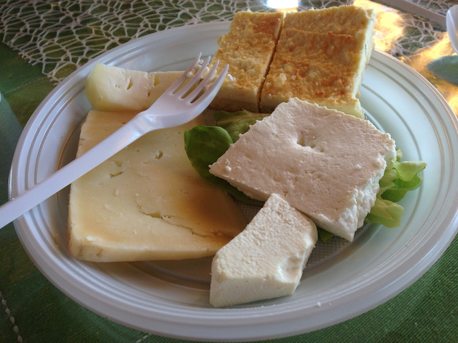

{.center} 

What is terroir? I know what it is supposed to be -- "the combination of factors, including soil, climate, and environment, that gives a wine its distinctive character" -- but I don't really buy that people can taste terroir. I don't dispute that discriminating palates can distinguish this wine from that, or even this side of the river from that, although the evidence on that score is not overwhelming. I do dispute that terroir is an adequate explanation for either the differences between similar products or the unique characteristics of a particular product. And "product" by now has extended way beyond wine to encompass cheese, sausages, beer and, for all I know, much else besides.

===

So I was delighted to spend the weekend at the Umbra Institute in Perugia, at the second [Food Conference Perugia](http://perugiafoodconference.org/): Of Places and Tastes: Terroir, Locality, and the Negotiation of Gastro-cultural Boundaries. People steeped in this sort of thing gave very erudite papers that differed somewhat in their interpretations and indeed definitions of the idea, possibly the result of the different academic terroirs in which their thoughts grew and were processed. Looking over my notes, some salient points were:

* Terroir is necessary to connect consumers to producers. Once markets open and supply chains grow longer and more complex, the producer needs to distinguish their goods from competitors, while the consumer needs a reason both to make a specific choice and, usually, to pay more for it.
* In making the connection between producer and consumer, the producer's human story is possibly an even more important component of terroir than soil, microclimate, environment etc. What we know of a product's human story can influence how much we appreciate its taste.
* Odd, then, that for many people who write about terroir the human work of making the product is often considered "manipulation" and somehow to be avoided. That goes for the landscape, soil and environment too. There are few agricultural environments less influenced by human hands than a vineyard, and yet visitors find nothing odd about gushing over the naturalness of the scene.
* While officialdom often uses terroir to encapsulate long-standing and historic approaches to food production, it also sets those approaches in aspic, preventing the kind of innovation that resulted in distinctive foods in the first place.

##After the talk, the cheese

{.center} 

On Sunday, we visited [Agrisolana](http://www.agrisolana.com/), a working farm nearby, where they raise sheep and make wonderful cheeses. The operation is typical of many shepherding operations in Umbria and Tuscany, run by Sardinian families who came with their flocks in the 1970s to buy up land left derelict by local farmers. Antonio Virdis told us about his life as a shepherd, and his son Peter took us through the magic of turning milk into cheese and ricotta, the final bits of twice-cooked whey going to the free-range prick-eared pigs rumaging around in the walnut grove. I found it fascinating. No surprise there. Did it make the cheeses we ate taste better? Will the chunk I bought taste as good at home? I truly don't know.

{.center} 

Some of these thoughts will be amplified in forthcoming episodes of [Eat This Podcast](http://eatthispodcast.com),[^1] and making those recordings is the reason this week's episode, [on Bones and the Mongol diet](http://www.eatthispodcast.com/bones-and-the-mongol-diet/) is going to be late. Apologies.

[^1]: 7 January 2016 Those episodes were: [What makes Parmigiano-Reggiano Parmigiano-Reggiano?](http://www.eatthispodcast.com/what-makes-parmigiano-reggiano-parmigiano-reggiano/), [Vermont and the taste of place](http://www.eatthispodcast.com/vermont-and-the-taste-of-place/) and [Who invented dried pasta?](http://www.eatthispodcast.com/who-invented-dried-pasta/).
