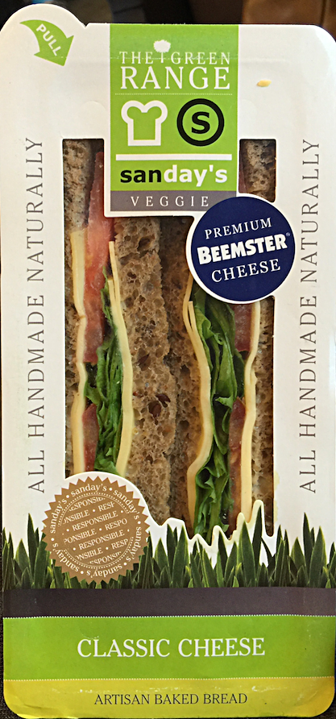

 {.center}

It is with profound regret that we report the final sad demise of Artisan, a noun recently pressed into service well beyond its capabilities. As a young person, Artisan was to be seen practising its trade, making a variety of products in limited quantities, often using methods learned from its forbears Craftsperson and Handworker. More recently, alas, Artisan succumbed to blandishments of the men in shiny suits and lent its imprimatur to several tawdry enterprises as far flung as [mousepads](http://www.artisan-jp.com/all_eng.html) and [kitchen mixers](http://www.kitchenaid.com/countertop-appliances/stand-mixers/). 

Artisan, absorbed in hookers and blow, was at no time aware of how its hard-won reputation as a mark of singular quality had been undermined by its unthinking endorsement of these activities. Even at the end, it was to be heard defending the right of all products everywhere to consider themselves handmade, no matter how unlikely that was. Individuality, Artisan was heard to mutter in its cups, was no great shakes anyway. 

The end, when it came, came with a whimper: the simple phrase "artisan baked bread" attached to a sandwich package that very obviously contained nothing of the sort.

Artisan is survived -- barely -- by heirloom, homemade and authentic.