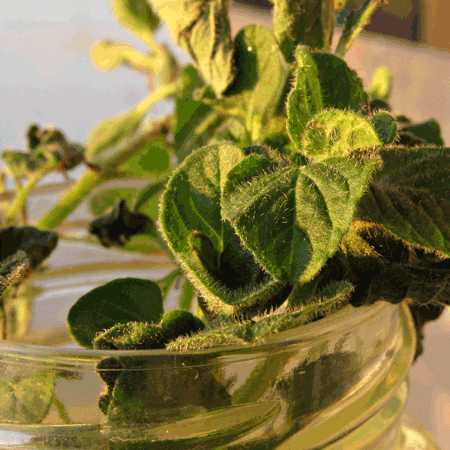

{.center} 

“I remember my Yorkshire grandmother, when as a small child I asked her if she used herbs, went very tight-lipped and said well there was pennyroyal … She had had a hard life, a brutal husband and too many mouths to feed.”

Pennyroyal is _Mentha pulegium_, a mint whose Latin name indicates that it was once used to deter fleas and other insect pests. For Gillian Riley’s grandmother, and women since at least the time of Aristophanes, it was probably more useful as an abortifacient. Which was why I saw red when a respected food blogger in Rome referred parenthetically to “_mentuccia_ (pennyroyal)”. But I need to backtrack.

===

People who've been with me here for a good long while will know that I have a bit of [a bee in my bonnet about binomials](http://jeremycherfas.net/2006/05/08/i-love-latin/). The formal Latin names of plants are an aid to communication. They help us to ensure that we're both talking about the same thing. Take recipes, for example. If I told you to use kidney beans for a dish, you would have a right to ask me what precisely I meant by kidney beans, lest you use the wrong thing entirely. Now, it just so happens that the artichoke (_Cynara_, not _Helianthus_ or even _Stachys_) season is upon us, and with it recipes for _carciofi alla romana_, Roman-style artichokes, the key to which is that the trimmed artichokes are stuffed with a generous helping of a plant Romans call _mentuccia_. It is a mint, but which mint? Say you want to make this at home, far from Rome; what do you stuff the artichokes with? Surely not pennyroyal. And yet, that was what Rachel was saying at her blog [rachel eats](http://racheleats.wordpress.com/2013/02/06/against-the-strain-of-modern-life/).

As an abortifacient, it didn't seem a good idea to be eating gobbets of pennyroyal in artichokes, so I did what anyone would do and searched for more information. And there is gobbets of that too, much of which does indeed equate pennyroyal and _mentuccia_. And much of which has clearly never gone beyond a search like the one I did. Some people even think that the Romans put evil pennyroyal in their artichokes deliberately to counter the healthful qualities of artichokes. For me, _mentuccia_ and pennyroyal are both members of the mint family, but separate species, _Calamintha nepeta_ and _Mentha pulegium_, and not even that closely related. It seemed that none of the confused cooks had actually taken those two plants and compared them as a botanist might.

I shared my concerns with Rachel, who to her credit immediately edited her post and shared her source: Gillian Riley’s [Oxford Companion to Italian Food](https://global.oup.com/academic/product/the-oxford-companion-to-italian-food-9780198606178?cc=us&lang=en&). As it happens, I am fortunate enough to have met Gillian Riley a couple of times, so I asked her for help. She very graciously shared some of her sources, and one can see where the confusion arises - in the common names! There are lots of them, and in particular, both _mentuccia_ and _mentuccia romana_ (which **is** pennyroyal) exist. But whereas some authors correctly distinguish the two, others say that _nepetella_ or _mentuccia_ is also called _mentuccia romana_. Italian wikipedia says _mentuccia_ denotes different species in different regions. It really is all very confusing.

{.center} 

There was nothing for it but to arrange a meeting at the shiny new Testaccio market. Thankfully [rachel eats](http://racheleats.wordpress.com/) and I share [a mutual friend](https://breadcakesandale.wordpress.com/) who acted as the go-between. We gathered last Saturday morning, me armed with my plant identification books, Dan with a just-bought pot of _mentuccia_ and some lists he'd made, and Rachel with young Luca. After lots of chit-chat, we visited Rachel's vendor Vincenzo, who had saved a big bunch of _mentuccia_ for us. Alas, no pennyroyal to compare with directly, but the leaves are round and barely toothed, whereas pennyroyal’s are narrower and more definitely serrated. This _mentuccia_ is without a doubt _Calamintha nepeta_ which, if you must have a common name in English, is probably best called Lesser Calamint.

Would it really matter if you did stuff your artichokes with _Mentha pulegium_ rather than _Calamintha nepeta_? Possibly not, at least if you didn’t do it too often. But really, why risk it? Especially when, as Rachel says after judicious editing: “In Rome _mentuccia_ is used but normal mint will suffice”.

I really cannot thank Gillian Riley enough for her generosity and graciousness. Likewise Rachel Roddy. Would that all authors were as open.