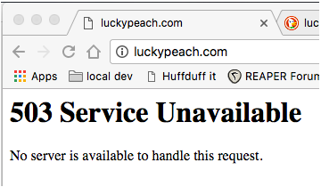

Lucky Peach was a great magazine about food; informative, witty, intelligent and eminently readable when most of the competition was nothing of the sort. But when it <a class="u-in-reply-to" href="https://www.nytimes.com/2017/03/17/dining/lucky-peach-closing.html" >died</a>, under slightly mysterious circumstances earlier this year, I didn't think too much about the consequences. I'd never actually been in a position to buy a paper copy, alas, but I very much enjoyed reading it online, which was generally a treat of both words and pictures. [^1] And so I thought, well, that's OK. It'll live forever, digitally.

===

{.center} 

But it hasn't. Not really. The original web address gives a 503 error. That means the server, where the content lives, is unavailable. Usually when you get an error like that, you try again a few minutes later and you find what you're looking for. Not so for Lucky Peach.[^2] It's solid gone, man.

##That worries me.

I needed things I read there for the next piece I'm writing, and as the site is dead, where am I going to find the information? On the authors' websites, obviously. But that's a dead end too. Only one of the five authors whose articles I want has a website that I could find, and -- wouldn't you know it? -- although she links to her story in Lucky Peach, the link is dead. Dead. Gone. Rotted away.[^3]

I accept that journalists may have reasons for not hoarding their every word. With luck they've been paid, and with more luck they'll almost certainly recycle many of those same words into a slightly different package that may stand a better chance of survival. They may even be worried about publishing themselves something that they were paid by the copyright holder to produce. I'd argue, however, that journalists owe it to themselves to keep copies of what they've written, and maybe they even owe their readers the opportunity to read their stuff once it has vanished from the publisher's site.

It isn't even difficult, and quite a few journalists do indeed maintain a publicly available repository or archive of their work on a website that they control. That's excellent, as far as it goes. But it could go so much further if more journalists embraced the principles of the IndieWeb: own your content, connect with your audience and control what you present.

My friend Chris Aldrich has written quite a bit about this. In <a class="u-in-reply-to" href="http://boffosocko.com/2017/01/13/the-indieweb-and-journalism/" >The IndieWeb and Journalism</a> he explains the reasons it makes sense, laments one fine writer who more or less vanished, and even goes so far as to offer advice to one journalist on how she could do even more with her site. Inspired by Chris's lead, I wrote a <a class="u-in-reply-to" href="https://www.jeremycherfas.net/blog/the-undercover-indiewebber" >similar sort of piece about a journalist I admire</a >.

##What's the problem?

The big difficulty right now is that it takes some effort. Motivation is not enough. You also need time, either to understand what is required and do it yourself, or to earn a bit of extra cash in order to pay someone else to do it for you. Although the IndieWeb website has a page on <a class="u-in-reply-to" href="https://indieweb.org/Indieweb_for_Journalism" >Indieweb for Journalism</a >, I doubt that it will actually inspire most of the journalists I know. 

The biggest single thing most journalists need is a one-click installation of a CMS like WordPress that would set them up properly, with a wizard to help them cast the spells of hooking up to their social media accounts and bringing all those interactions back home. I know there's talk of such a thing, but until it is a reality, preferably with a facility to import old articles or even a previous website, I fear the number of IndieWeb-enabled journalists is going to remain rather low.

[^1]: I don't think that contributed to its demise, and I would have been happy to pay for an online subscription, but I didn't need to.
[^2]: The domain is still owned by the person who developed it with Lucky Peach and who has owned it since March 2015.
[^3]: Have no fear, I did find what I was looking for, and the article will appear, but still ...