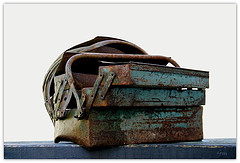

{.left}I think I may be in love. It's a long time since I've felt this way, since I've been eager to explore the further reaches of an infatuation. And an especially long time since a piece of software had this effect on me. I'm talking about Bookends, a piece of bibliographic magic for the Mac. But let's step back for a moment.

When I first got into the business of writing serious stuff, like theses and papers, the cool kids used the most wonderfully sophisticated technology; 3 x 5 cards. But a few of us went further. We had 5 x 7 cards. And further still. Those cards had a row of little holes around the four edges. And this was the deal: you devised an arcane system whereby, say, the top edge's holes represented big concepts, the left edge was the initial of the last name of the first author, the right edge was journal, and the bottom edge was small concepts. And you wrote, on a Master Card, which hole represented what. Then, when you came across some wonderful new piece of information in a book or journal, you wrote up a card for it, with all the details you might later need. Xeroxing was out of the question; too expensive. Then, if you were supercool, you got out the special pair of snippy things that fit the holes and you snipped out the appropriate holes for big concepts, small concepts, author and journal. If not, you just ripped them.

So now you have a filing system. And the retrieval mechanism was a knitting needle. Want all your references on "chickens" and "visual acuity"? Find the Master Card (pray you haven't lost it), find the hole for chickens, slip the needle into that hole and gently shake the stack of cards. All those punched for that hole slip free, if you're lucky. Gather them up, now slip the needle through the visual acuity hole and shake again. And there they are, the references for both chickens and visual acuity.

Ah, the joy of tech. Sorry to be so long-winded in explanation, but you have to spell things out for the new kids, give them the whole word picture thing, if you will.

You have no idea how much I hated the whole fucking mess.

So as computers shrank, and bibliographic software started to appear, I dabbled. But it was, if anything, more complex. There was the copy typing, for a start, and the dreadful search abilities of most that I tried, and the need to decide in advance how many user custom fields you might need, and a whole litany of other horrors. I must have tried half a dozen such packages before finally and blissfully abandoning the very idea and instead embracing the random access system that is my inner mess.

On the internet, many years later, I was a reasonably early adopter of del.icio.us and citeulike, but only as larger, web-based random access systems. Until yesterday, when I finally decided I had had enough of scrabbling around looking for the one reference that will render credible some outlandish claim I had to make. I Googled. Up came two contenders. I checked them both out. I read reviews. I took Bookends for a test-drive. And here I am, smitten.

Now is not the place to hymn my love's virtues. There are plenty of others who have already done so. But I did think it might not be a bad idea to share some items from my current writing toolkit.
	
  * There's [Bookends](http://www.sonnysoftware.com/), the newest, whose capabilities I have barely begun to explore.
  * There's [WriteRoom](http://www.hogbaysoftware.com/product/writeroom), on which I am composing this very post, with its fabulously uncluttered environment and -- do I hear those punched cards calling? -- the most evocative green-on-black screen. (When I get bored I change it to orange on black.) Will Bookends talk nicely to Write-Room, the way it does to Word? Something else to explore. *It doesn't. Who cares?*
  * There's [PTHPasteboard](http://pth.com/products/pthpasteboard/), the thinking person's clever clipboard. *RIP*
  * [Notational Velocity](http://notational.net/) I find astounding, although I confess I probably do not use it as much as I could because I need to learn to make it routine. (Note, to self, in NV: do it.)
  * And there's [ecto](http://ecto.kung-foo.tv/), which I will shortly use to post this paean through the tubes. *Moribund.*

There are others, I know, that others praise to the skies. Quicksilver, and DevonThink spring to mind. But somehow those have never quite made my pulse quicken. Tell me why I should give them another chance?

*[flickr photo](http://flickr.com/photos/couleursgm/261350329/) by [couleurs gm](http://flickr.com/photos/couleursgm/), used under a Creative Commons license*