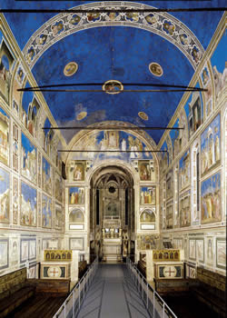
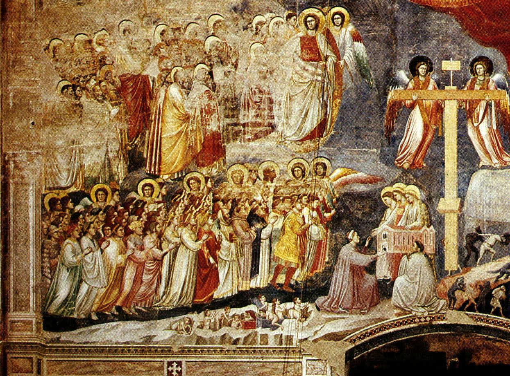

The Italian attitude to rules and regulations -- that they exist only for other people -- is one of the most maddening things about living here; except, of course, when it works for you.

===

{.center} 

We had used the fearsome online system to book a visit to the [Scrovegni Chapel](http://www.cappelladegliscrovegni.it/eng/index_e.htm) in Padua. What with one thing and another, we didn't arrive at the Eremitani Civic Museum until half an hour after the allotted time. The man at the desk was brusque and noncommittal. He'd give us the tickets, for which we had in any case paid, and we could try to hurry along, but it stated  very clearly (which it did) that if you missed your slot, you had missed your slot and would have to rebook, and repay.

Being rule-fearing foreigners still, we scurried to find the chapel, _via_ one distant detour. We eventually got there just as the airlock sealed on the group after our scheduled group. Hopeless. But it was a lovely sunny day, and there was a bench to sit on before we tried our luck, and a gaggle of schoolchildren with no obvious interest in Giotto provided entertainment. Time passed. The airlock opened. The schoolchildren mobbed the entrance, where two people took admission tickets.

"Let's try the man," I said, sexist to the core. "Women are much more likely to be sticklers."

"Sure."

The man barely glanced at our 40-minute out-of-date tickets, and we were in. I heard some muttering behind about the entry time on some of the tickets, but I don't think he remembered whose they were. The airlock shut and there we were, watching cheesy videos with generic baroque-ish music as the moisture was apparently sucked from our being, the better to protect the frescoes. The crowd before us left, the inner door opened, and we were ushered through.

No words of mine can adequately do justice to the chapel decoration, which is sublime in a non-awesome way. There is a [fantastic set of images at Flickr](http://www.flickr.com/photos/renzodionigi/sets/72157621044210814/with/3689563687/), which I cannot share as all rights are reserved. And while looking for images I could use, or at least didn't feel too badly about stealing, if that's what I did, I lucked into [a great take on what Giotto is up to](http://paulkarasik.blogspot.com/2009/06/reading-picture-writing-on-wall-ii.html), which I highly commend. Anyway ...

We shuttled away from the schoolchildren and just looked and looked. At one point I was puzzled by a particular scene, so I asked the very dapper custodian. It was not, as I had in my ignorance thought, the Last Supper but the Wedding Feast at Cana; duh. The custodian told us a bit about it, and some of the other scenes, and when the beeper sounded for the changing of the groups, he came up and quietly asked us if we would like to stay for a second session, which gave us another 15 minutes of heavenly contemplation.

So, this once, thank you, rule benders.