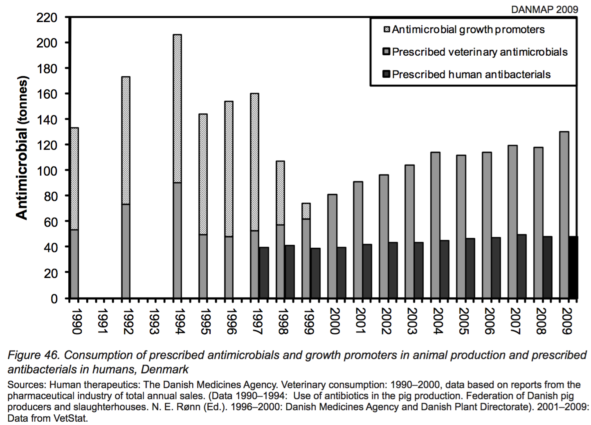

Editing the recent podcast on <a href="http://eatthispodcast.com/antibiotics-and-agriculture/" Class="u-in-reply-to">Antibiotics in agriculture</a> was far harder than I expected it to be, mostly because I had to cut away stuff that is important, but just didn&#8217;t fit. Much of that was about how, in time honoured tradition, antibiotic manufacturers and veterinarians sowed doubts about who was to blame for what. Here&#8217;s a bit of that. Claas Kirchhelle&#8217;s paper uncovers a lot more.

===

The Animal Health Institute is an organisation in the US that represents many manufacturers of veterinary products. If you go to the <a href="http://www.ahi.org/issues-advocacy/animal-antibiotics/">Animal Antibiotics section of the AHI&#8217;s website</a>, you&#8217;ll find, among other things, a page on <a href="http://www.ahi.org/issues-advocacy/animal-antibiotics/the-antibiotic-ban-in-denmark-a-case-study-on-politically-driven-bans/">The Antibiotic Ban in Denmark: A Case Study on Politically Driven Bans</a>. Given that everyone I&#8217;ve spoken to seems to regard Denmark as a shining example of how to regulate antibiotics in agriculture, I wanted to see what the AHI made of it. 

Their conclusion:

<blockquote>

<strong>Bottom line:</strong> A ban on AGPs in Denmark has not had the intended benefit of reducing antibiotic resistance patterns in humans; it has had the unintended consequence of increasing animal suffering, pain and death.

</blockquote>

To back that up, the AHI helpfully publishes this graph.

{.center}

This does show an increase in the therapeutic use of antibiotics, which exceeds the amount used before Denmark&#8217;s ban on antibiotic growth promotors came into force. Claas Kirchhelle said as much when we spoke. In fact, just a cursory look at the graph suggests that antibiotic use is much higher in 2009 than it was in the peak year of 1994. Which, of course, is exactly what the AHI would like you to think. There are, however, a couple of worrying things about that graph. First, why are the years across the bottom evenly spaced, when there are years missing? That&#8217;s always fishy. Much more importantly, why does the graph end in 2009, when here we are in 2017?

Bravely, the AHI provides a link to <a href="https://www.danmap.org/~/media/projekt%20sites/danmap/danmap%20reports/danmap_2009.ashx">Denmark&#8217;s official report for 2009</a>, so I didn&#8217;t have to hunt for it myself. And there, of course, is the official version of the same graph.

{.center} 

A couple of things to note.

<ul>
<li>The Danes do not skip years for which they don&#8217;t show data, so the slopes, which indicate how quickly things are changing, are more accurate.</li>
<li>For the years up until 1999, the Danes stack AGPs and therapeutic antibiotics on top of one another, showing total use of antibiotics in animals. So you can see that although therapeutic use has gone up, <strong>total use</strong> is quite a bit lower in 2009 than it was in 1994.</li>
<li>The Danish graph shows figures for the human use of antibiotics from 1997 onwards; it may be increasing slightly, and is about one-third the use in animals. AHI does not show these data at all.</li>
</ul>

These points all make me think that maybe the AHI redrew the graph not merely to inject colourful chart junk but also to hide the facts it represents. Looking at the official Danish graph for 2016, published just a week ago, makes me certain.

{.center} 

Well, would you look at that. Antibiotic use in animals started to decline in 2010 and has continued on a downward path. In humans it has gone up a little.

To me, this manipulation of the data (and a whole lot else on the AHI site, like the <a href="http://www.ahi.org/issues-advocacy/animal-antibiotics/antibiotics-and-danger/">utterly ludicrous probabilities here</a>) fully confirm my view that the AHI knows perfectly well that it hasn&#8217;t got a leg to stand on. Other organisations fighting tighter regulation of antibiotics and livestock are probably the same.

There&#8217;s more, much more, which is why editing the podcast was so hard. Like the evidence that in the UK the Association of the British Pharmaceutical Industry lobbied hard to have the editor of <em>New Scientist</em> magazine fired. Bernard Dixon, himself a microbiologist, was instrumental in drawing public attention to the very clear evidence collected by E.S. &#8220;Andy&#8221; Anderson of the Public Health Laboratory Service, connecting antibiotics on the farm with antibiotic resistance in bacteria and &#8211; most importantly &#8211; demonstrating that resistance could move from harmless bacteria to pathogenic ones. 

Part of the industry&#8217;s argument against greater regulation of antibiotics is that because antibiotics are also used in human medicine, we can&#8217;t be sure how much resistance is the result of medical use and how much the result of use on the farm. In one sense, animals and humans actually receive about the same amount of antibiotics a year, if you measure antibiotics per kilogram per organism. But the total biomass of animals getting antibiotics is far, far greater than the mass of humans; overall something like 70&#8211;80% of antibiotics go to agriculture, not human medicine. Worse, in animals almost all antibiotics are given in sub-therapeutic doses, perfect conditions for selecting resistant bacteria. 

Of course there are gaps in our knowledge; there always are. But that is not a good reason to block action. The final part of the <a href="https://amr-review.org/">McNeill report for the British government</a> has this to say (p 10):

<blockquote>

Where gaps in the evidence remain, they should be filled But given all that we know already, it does not make sense to delay action further: the burden of proof should be for those who oppose curtailing the use of antimicrobials in food production to explain why, not the other way around.

</blockquote>

*Cross-posted from Eat This Podcast*
