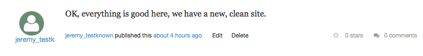
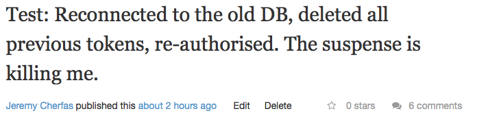

As soon as micro.blog added the ability to crosspost to a micropub-equipped site, I've tried, sporadically, to get it to work with my Known site. It never would work, and proved extremely frustrating to troubleshoot. Other people would just say, "It works for me" and because the problem clearly lay somewhere between the two entities it was very hard to know where to begin looking for trouble.

===

When Manton saw my distress and decided to install Known on DreamHost specifically to test, I was heartened. When he reported, "It works for me" I knew I would have to dig deeper, and that's OK too. After some consultations with assorted experts, I formulated a plan. This is part 1.

##Create a fresh new install of the stable, public version of Known

This would also be an opportunity to work through the recent notes on <a class="u-in-reply-to" href="http://www.kiaikim.com/2017/how-to-install-the-known-platform-on-a-dreamhost-shared" >How to Install the Known platform on a Dreamhost shared server</a >.

Reading through those notes, my first impression was that it was pretty telegraphic and assumed a fair bit of prior knowledge. For example, it talks about unzipping via ssh without giving any further instructions. I also thought that setting up the (sub-)domain and MySQL **before** doing anything else would be more effective. So that’s what I did first.

In the admin panel at DreamHost, I went to Domains > Manage Domains and added a new subdomain. I used the same user and PHP (5.6 FastCGI) because that was what the dodgy site had. I added a Let's Encrypt certificate too, because the dodgy site had that.

DreamHost told me that all is good and that it will take some time to propagate. This was at 10:49 AM 

At this stage, I had a few options:
 
	1. Download the zip, unzip it and upload the files to the server at Dreamhost
	2. Download the zip, upload the zip and unzip it at the server.
	3. Clone the latest stable release ‘Derbyshire’ from Github
	4. Clone the latest master from Github.

I decided to go with the first, because although it takes the most time, it also requires the least expertise.[^1]

[^1]: Full disclosure, I don’t actually know how to upload an entire directory via SCP, nor how to unzip in a remote server. So there was that. *Later*: Unzip is actually rather easy. `$ unzip archive.zip`.

While I waited for the sub-domain's details to propagate, I set up a new database under the old hostname with a new username and a new password. The new username and password weren't strictly necessary but might help with cleanup later. And, as advised by Kiai Kim, I made a note of the details.

I also [downloaded the Known zip file](https://withknown.com/opensource/) and unpacked it.

By now it was 11:01 AM. Is the structure for new sub-domain there yet. It is!

I used my SFTP client (Cyberduck) to upload all the files to the new folder on my server, and yeah, the estimate was that it would take quite a few minutes. I can wait. In the end it took a little less than 30 minutes.

Time to visit the domain. Perfect! I see the welcome screen, but when I moved to the next step there was a warning about HTTPS and another about `mod_rewrite`. The `mod_rewrite` is not important, but I tried again with  HTTPS and all was good.

11:43 AM First post published. 

{.center} 

As Kiai said, "Installing Known on Dreamhost is super easy". Aside from doing the DreamHost end first, her instructions are fine. If my notes make it even easier, well, that's great. On to part 2:

##Connect micro.blog to the fresh new Known

In a sense this was disappointingly easy; there just weren't any problems. First I added the RSS stream for the new site to my account at micro.blog. I created a post in Known and it was picked up by micro.blog. I replied to that post from micro.blog and it was picked up by Known. So far so good; two-way communication between Known and micro.blog.

Now I connected the micro.blog app on OS X to the home page of the fresh new Known. That went without a hitch. I created a test post and it went through without a murmur.

###It works for me!

In search of the problem, I did what I have been conditioned to do by years of working with WordPress: enable the plugins, one by one, until I broke the system. So I did that, testing after each one and probably annoying onlookers at micro.blog in the process. Each test post was faithfully shared back to the fresh new Known. In the end, all the plugins had been enabled and all was still working. Rats!

Then I noticed that the plugin that supports POSSE to [Pnut.io](https://pnut.io) was not present on the fresh new Known. Rather than install it, I switched back to my original Known and disabled it there, but that wasn't the problem. Posting from the micro.blog app now produced the same error as it had all along.

##Back to the beginning

What now? All I could think of was a clean install into the original sub-domain. It would be easy enough, I confirmed with experts[^3] yesterday, to hook up to the old database once I had proved that everything was working as it should. And if there was some problem with the database being corrupt in some way, then reattaching the old database would break it, and offer a new place to look.

[^3]: I had so much help from so many generous [IndieWeb people](https://indieweb.org/IRC_People): zegnat, sknebel, cweiske, cleverdevil, manton, aaronpk, kevinmarks, petermolnar and others. 

To be safe, I downloaded the `config.ini` and `.htaccess` files from the original Known, so it would be easier to re-attach everything. I decided to create an entirely new database for the fresh install and went through the same steps as for the fresh new Known. This time, though, I didn't fancy waiting the 30 minutes to upload all the files by SFTP, so I uploaded the zip file and used my new found knowledge to unzip it in place. This was a minor mistake. I had thought that the unzip command would create a directory in which to place the files, as it does on my Mac without being told. It didn't,[^2] but it wasn't hard to move all the files that were needed because they all had the same date.

[^2]: The correct command would have been `$ unzip archive.zip -d targetdirectory`.

It was now 1:19 PM. The empty Known was there. And the micro.blog app could post to it. Time to hook up the old database. At this point I noticed that the old config.ini contained two lines that were not in the new one created by Known:

````
session_hash_function = 'md5'
antiplugins[] = 'Convoy'
````

I did briefly wonder what that meant, but left them out. In any case, reconnecting to the old database worked fine. Now I deleted all previous tokens for micro.blog, re-authorised it, wrote a post and held my breath.

{.center} 

##It really does work for me

I have no greater idea of what the problem was. All I know is that it has gone away.

All I need to do now is clean up after myself at DreamHost, and figure out what exactly I have gained.