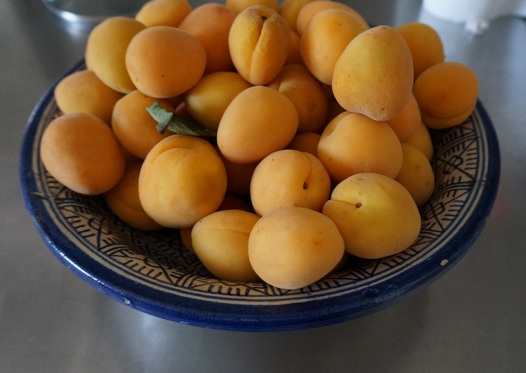
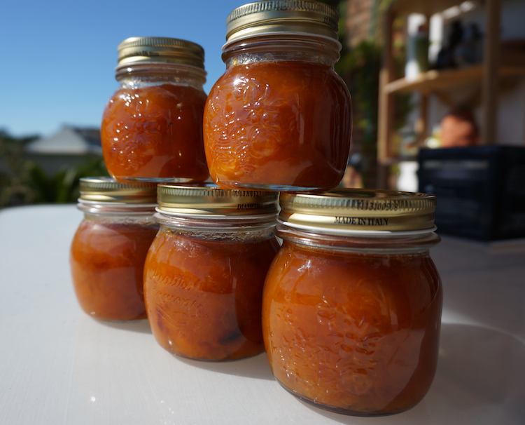

{.center} 

When apricots are 3 euros a kilogram in the market (with smaller ones -- more slicing -- for 2 euros) what's a chap  to do? Make apricot jam, obviously. 

===

Off to the Internets, where recipes are, if anything, even more abundant than apricots. They're very variable. Many involve pectin and additional sterilisation in a water bath. One adds grated carrot, ginger and chopped almonds, which may be "unusual" but isn't quite what I was looking for. Too much choice is always an affliction. Then I saw an [apricot jam recipe from David Lebovitz](http://www.davidlebovitz.com/2009/08/apricot-jam/), a name to conjure with. Four essential ingredients and one crucial piece of advice:

> Because fruit doesn’t grow in standardized quantities (at least the fruit I want to eat) my general rule is to use three-quarters of the amount of sugar per one-part apricot puree. So if you use more, or less, apricots, simply use for each cup of puree, by volume, three-quarters cup of sugar.

I can really relate to ratios.

And so it was that on a sweltering summer's day, I found myself slaving over a hot stove. And the result, although I say so as shouldn't, was pretty good, judged purely on the basis of licking from the cooled pot.

{.center} 

David says it will keep "up to one year if refrigerated".

It should last that long.