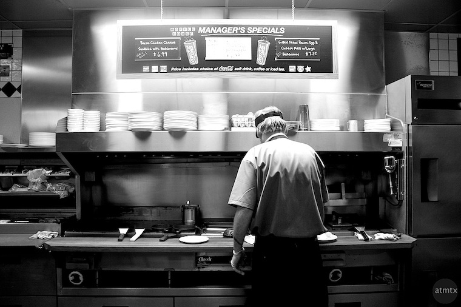

{.center} 
Back before there were blogs (honest; I promise this is true) my little company website had a kind of diary of newsletters, updated roughly once a month, and delivered by hard-coded HTML tables. It looked, I fancied, a little like an index card file [^1] with little tabs at the top for the various dates, and some fancy backgrounds in the cells that showed you which month you were looking at. I was really quite proud of it, even though each new month meant a flurry of cut-and-paste as I rearranged the tab cells around. So I was primed to like this new-fangled weblog stuff, and adopted it with alacrity. 

First I played with [Nucleus CMS](http://nucleuscms.org/), which I’m happy to see is still going strong. Then I had a brief fling with [Tinderbox](http://www.eastgate.com/Tinderbox/), a much under-rated programme that in the end I gave up on because I couldn’t get anyone else at work interested, and I didn’t use it enough on my own to keep paying the fees. Tinderbox really is rather wonderful, and I know I barely scratched its surface. Worth remarking here is that a website that originates from Tinderbox is (or was) completely static. So no worries about databases or any of that. I had no idea at the time that I’d be looking back at static HTML sites with enormous fondness.

I abandoned Nucleus CMS and Tinderbox for WordPress quite early on, round about WP 1.3, and loved that WP let me do do so many seemingly complicated things so easily, the natural result of clever people being encouraged to share their cleverness. Lately, however, WordPress has been turning into more and more of a liability; it regularly crashes my server, goes into a funk and slows down alarmingly, and opens the door to all kinds of (in)security paranoia. A cyber-pal says that's because the clever people aren't quite as clever as they think they are. Maybe so, but the real downside is that it is now so complicated and beyond my competence that I am hopelessly unable even to ask the right questions to start fixing it. When things went belly-up elsewhere, and I had a week more or less spare, I switched this site over to [Octopress](http://octopress.org/), and I’m super happy with that.

It wasn’t until I started tidying relict posts from the ancient past, though, that I realised that I had come full circle, and was once again serving fully-baked sites.[^2] This time, though, thanks again to the cleverness of others, I don’t have to do the cut-and-paste of updating myself. I just have to write the stuff — which was always the point — and the software does the rest. Workflow remains more complicated than it was with WordPress and Marsedit, but at least I can agree with Aaron on this:

> Some people seem to think that I want to bake because of perfomance. Honestly, I don’t care about performance. I don’t care about performance! I care about not having to maintain cranky AOLserver, Postgres and Oracle installs.

I’ve no idea what an AOLserver or an Oracle install is, although I have heard of Postgres. I just know that now I don’t have to deal with them either, at least not now that everything’s set up. And if I could find a good way to move [the big blog](https://agro.biodiver.se) somewhere else, I would.

Because I don’t need to be stood here like a frazzled short-order cook.[^3]

[^1]: Not that any of the youngsters know what that looks like.

[^2]: At which point, in addition to linking to Aaron Swartz’s [Bake, Don’t Fry](http://www.aaronsw.com/weblog/000404) post, I should also link to what Mark Bernstein, author of Tinderbox, [had to say in response](http://www.markbernstein.org/Jul0201/BakedNotFried.html). Note, chums, this was from 2002, when fried sites were just getting going.

[^3]: Photo by [atmtx](http://www.flickr.com/photos/atmtx/4250159996/) on Flickr.