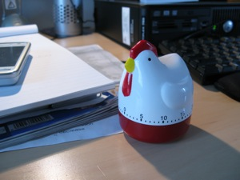

{.left} Ever a sucker for new productivity porn that will make me effective, successful and attractive to small animals, I'm kicking the tyres of [The Pomodoro Technique](http://www.pomodorotechnique.com/index.html). In a nutshell: work at something for 25 minutes, resisting all distractions; take a 3-5 minute break; repeat. Every four sessions, take a long break.

===

This all happened because I read an [interview with Brett Terpstra](http://www.lifehack.org/articles/2x4-an-interview-series/2x4-an-interview-with-brett-terpstra.html), one of the most helpful and life-enhancing Apple geeks in the entire universe. His [changes to Notational Velocity](http://brettterpstra.com/project/nvalt/) had already changed my life for the better, so when he mentioned Pomodoro (which I _think_ I may have heard about before) I was primed to try it. 

I won a kitchen timer a couple of years ago at the works tombola, and up till now I've used it only to rouse me from my <strike>slumbers</strike> workflow to ensure I don't miss the train. The Pomodoro Technique suggested a better use for it. 

Yesterday was our first full day together, me and my trusty timer, and I must say, I was impressed with the amount I managed to get done. There's something about knowing I can goof off in 24 minutes at the most that enables me to hold off goofing off. Alas, the timer wasn't quite up to it. The penultimate pomodoro of the day seemed to drag … and then I realized that the timer wasn't timing anything. So last night's first order of business was to buy a new timer, and so far today she has done sterling service. Unflappable.
