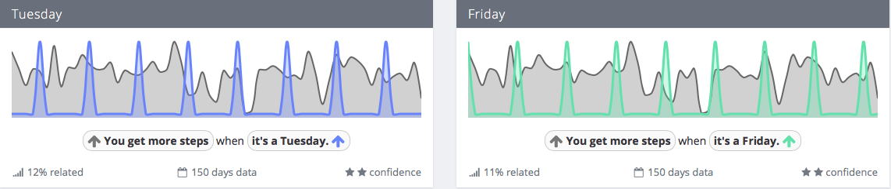
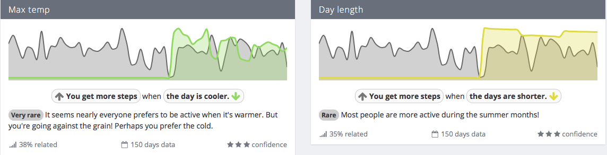

It has been an interesting month, not least because on 11 November I pledged to be more alive to recording and reviewing my activities. This is the result, a few days late. Interesting too because I was away for 10 days, attending the memorial service for my PhD supervisor, swanning around (very) old haunts and spending time with my family. A good break.

===

##Exist.io

I signed up for [Exist](https://exist.io) immediately after reading about it, and it has been fun to use. One thing that has become obvious is that my mood is generally very positive (which I knew anyway). Fours and fives all the way. (I scored my first three yesterday.) Because it has less than a  month of data so far, Exist has not yet been able to tell me very much about mood and the custom activities I am tracking. But it also imports some data from Apple Health, which gives it a lot more to work with. And that has revealed some gems.

{.center} 

I walk more on Tuesdays and Fridays. Tuesdays is no surprise. That's when I meet an old friend for coffee in the morning on the other side of the park, so I get a head start on the day's steps. But Fridays? Beats me. Neither effect is all that strong, mind. And there are some others that I won't bother illustrating, like walking more when I wake up earlier.

{.center} 

There's something strange about the relationship between weather and activity. I think what is happening is that in June and July, while on holiday, I walked less than average, certainly that's what my step counter shows, and now that I am back up around average Exist is relating that to the colder weather and, d'oh, the shorter days.

Presumably there are more interesting insights to come.

##"Work"

Why the "scare quotes"? Because I am in the very fortunate position of occasionally being paid to do stuff I like to do anyway, and of being able to do stuff I like even more for no financial gain. Is that work, or is it fun? I don't care.

###Pomodori 7.5 per day (75 in 10 working days)

As I've [mentioned before](/blog/time-measurement-time-management), I used to use the Pomodoro technique to measure and manage work time. This month I started again, with one important change. I don't use the timer for everything, only for those things that need concentrated work. Time spent going through emails or my feed reader doesn't count. Unfortunately, I didn't realise that the free app Tomato One does not, apparently, record more than two weeks worth of data, so I can't present totally accurate data. However, I do mark them off by hand too, so was able to reconstruct successfully. 

Is 3.5 hours a day high? I don't know. I do know that I must keep trying to estimate time needed before starting to work and reviewing that information to refine my predictions.

###Toggl 42% admin, 28% podcast, 30% everything else.

Tracking specific tasks in Toggl is a useful adjunct to the Pomodoro technique, because it allows me to keep vague tabs on time spent doing the things I choose not to use Pomodoro for (which I call admin, out of an inflated sense of self-importance), and more  accurate tabs on work for clients, myself included. 

###Goals 

On 11 November I set myself the goals of writing one new post and bringing in five old posts a week to the mothership, here. I managed seven old posts and no new posts. Bad! 

The old posts:

* [Take me to the Towers of Silence](/blog/take-me-to-the-towers-of-silence) 
* [Of coarse it matter how your writing](/blog/of-coarse-it-matter-how-your-writing) 
* [Sauce for the atheist goose](/blog/sauce-for-the-atheist-goose) 
* [You can study love](/blog/you-can-study-love) 
* [The power of lard](/blog/the-power-of-lard) 
* [How is a TED talk like a Louis Vuiton handbag?](/blog/how-is-a-ted-talk-like-a-louis-vuiton-handbag) 
* [Me and jellied eels](/blog/me-and-jellied-eels) 

I would like to be more active in contributing to [the agricultural biodiversity weblog](https://agro.biodiver.se), in addition to managing behind the scenes, but a disastrous decision to migrate the server meant almost all my efforts were in fact directed behind the scenes. With luck, that will not be repeated any time soon.

I did manage to post to my [WithKnown site](https://stream.jeremycherfas.net), to raise [Fornacalia](https://fornacalia.com) from the dead and to keep [Eat This Podcast](https://eatthispodcast.com) fed.

##Activities

###Steps 106.0% (344,800/325,275) 88th percentile

It takes a bit of digging to get monthly cumulative steps out of Garmin Connect; you have to select the 6-month or 12-month report. Otherwise you get calendar weeks, which are of course more strictly comparable but might not be as easy. In the end, I've decided to score myself on steps as a percentage of goal, for the calendar month.

###Sleep Time 8 Hours 30 Minutes 48th percentile

Two surprises. I thought it would be lower, closer to 8 hours or even 7:30. No evidence; just a feeling. And, given the actual value, I'm surprised to be below the 50th percentile.

##Itches

* A journalling app to replace Day One Classic. I'm currently sticking brief summary notes into the daily assessment in Exist, but it is not fully satisfactory. More research needed.
* Get back to work on my effort to import the things I am reading into my WithKnown site.
* Different tracking software for time spent on computer activities and in apps?
* Record what I've read?

##Final remarks

In a nod to Lukas Rosenstock, I'll note that analysing the month and writing this post took me Six Pomodoro sessions.
