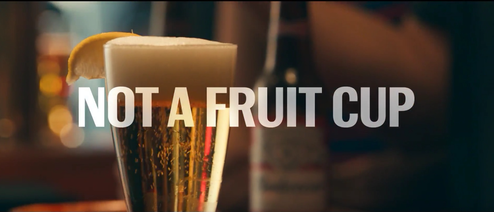

{.center} 

Phil Howard, of Michigan State University, casually let slip in our conversation about [concentration in the food industry](https://www.eatthispodcast.com/who-owns-whom-in-the-food-industry/) that a brewery in Australia had been fined for faux craft beer. I had to investigate. Its quite an interesting story.

===

Byron Bay Pale Lager comes with "labelling that incorporated the name Byron Bay Pale Lager, a pictorial representation of a lighthouse, text regarding Byron Bay and a map of the Byron Bay region showing the location of the Byron Bay Brewing Company," according to the [Australian Competition and Consumer Commission](https://www.accc.gov.au/media-release/accc-acts-on-beer-labelling). 

Fair enough. Byron Bay  is the kind of hippy dippy place where a little local brewer might be concocting some fine craft beers. And Byron Bay Brewing Company does in fact make a Pale Lager. As the bottle's label explains:

> We're housed in an historic location, a birthplace of much of the fame and spirit of Byron Bay which has attracted local and international musicians, artists and alternative thinkers since the '70s. Next time you're in town, drop in and have a beer.'

So what's the problem? Unless you were actually in that historic location, the Byron Bay Pale Lager you were downing was actually brewed by Carlton & United Breweries at a site hundreds of kilometres to the south, near Sydney. The ACCC fined Carlton & United a piddling amount &mdash; $20,400, AUD presumably &mdash; for misleading consumers. CUB [promised](https://www.accc.gov.au/public-registers/undertakings-registers/s87b-undertakings-register/cub-pty-ltd-s87b-undertaking) not to do it again (at least for three years), and to "provide supplementary training for senior managers within CUB’s marketing department".

And, of course, Byron Bay Brewing Company was more than happy to take CUB's money at the outset, as are lots of craft brewers [in Australia](https://theconversation.com/why-craft-beer-is-going-corporate-85668) and [elsewhere](https://www.thestreet.com/slideshow/14264995/1/fake-indie-beer-these-15-independent-craft-brewers-have-deep-pocketed-owners.html).

## Everybody's doing it

I suppose I shouldn't be surprised that this happened in Australia, the place that may have invented [faux dough "sourdough" bread](https://www.smh.com.au/entertainment/faux-or-dough-20120110-1pt8g.html). But the business of crafty marketing seems global.

- [Walmart does it](https://www.democratandchronicle.com/story/news/2017/02/15/walmart-trouble-brewing-genesee-brewery/97966226/) in the US.
- [Heineken does it](https://www.fft.ie/when-micro-meets-macro-the-future-of-craft-beer-in-ireland/13659) in Ireland.

And as heard in the podcast, the practice is rife in America. I'll bet there are plenty of other examples around.

Perhaps the strangest aspect of the whole David and Goliath nonsense is the Budweiser Superbowl adverts in 2015 and 2016. Someday, I predict, and probably quite soon, nascent marketeers will write wordy theses about the story, none of which will do anything to dispel the sheer delight of [the advertisement](https://www.youtube.com/watch?v=zEMl2h1qHLA) and its [exegesis](http://www.thebeerbabe.com/2015/02/why-the-pro-macro-beer-budwesier-ad-is-so-dangerous/).