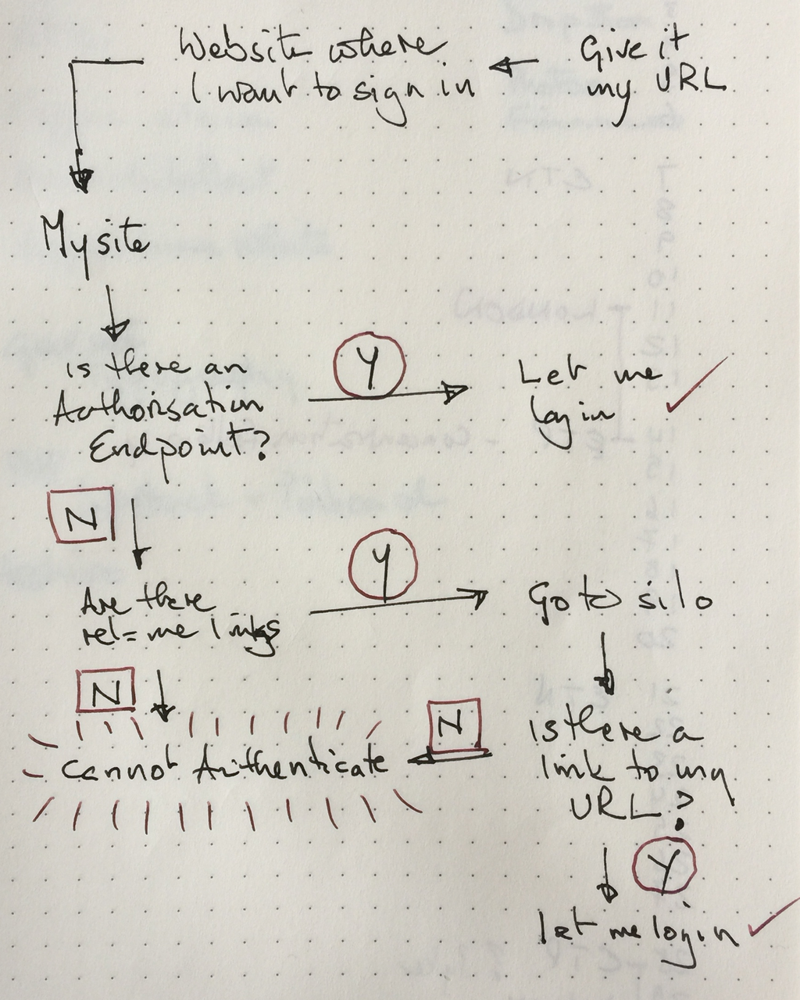

One of the key problems online is to prove that you are who you say you are. If you are, then I can allow you to do certain things. 

These two things are usually called authentication and authorisation.

===

!!! That both words start "auth" is part of the fun.  
!!! So some people use authn (establishing that I control a URL/profile) and authz (giving someone else [usually an app] some control over the URL/profile).  
!!! [Kevin Marks][kevinmarks] offers "Authentication is ['it me'][papermag] Authorisation is 'can I haz?'."  
!!! On StackOverflow I found [Aditya Mittal][stackoverflow] saying "It is easier in my head and in my code to think of 'verification' and 'permissions'."  
!!! And then there's a final layer of difficulty because you will be authorised only if you have been authenticated, so authorisation is generally the end result we're looking for. Anyway ...

There has been quite a bit of activity in the past couple of weeks in the IndieWeb community building new ways to authenticate and authorise, and I found it very confusing, mostly because I didn't have a solid understanding of the logic, let alone the processes. So I took advantage of a recent [virtual Homebrew Website Club][indieweb] to ask Martijn van der Ven to explain, which he did. Brilliantly. 

This is my attempt to capture my understanding. It is not a complete history. And it is almost certainly wrong in parts. Possibly completely. Feel free to correct me.

The story begins with [RelMeAuth][microformats], a standard that allows authentication by requiring you to have a link in your domain identified as `class="rel-me"`. That link points to some other site, usually a silo that is under your control, say Twitter or Github. There, maybe in your profile, you have another link that points back to your original domain. The logic is that you, and only you, can add the link to both places, on your site and back to your site from Twitter or Github.

What happens next is that when you want to prove to some other website (such as the [indieweb.org wiki][indieweb 2]) that you are who you are, you give it your domain's URL. Behind the scenes, an authentication app looks at the URL you supplied, searching for a `rel=me` link, and then goes off and looks at the `rel=me` link. If that contains a link back to your domain -- bingo! -- you are who you say you are.

This is the RelMeAuth dance, and it works. But it means that every site that wants to be able to authenticate you (perhaps to authorise you to do something later) needs to ask all the various authentication sites to be an app. To get around that, Aaron Parecki created a site called [IndieAuth.com][indieauth], which acts as a service that will perform the RelMeAuth dance for you.

IndieAuth.com works really well, but it too faces a couple of difficulties. One is that there is another thing called IndieAuth, which is the _protocol_ that lies behind the RelMeAuth dance. IndieAuth.com provides a _service_ that takes care of everything for you. Some people (definitely me) find that confusing.

More importantly, why should I have to have another account somewhere else just to prove I am who I say I am? The response to this second issue lies behind the recent flurry of activity. People have been building ways that need only your one domain. You have access to that; that should be enough.[^1] 

These newer apps allow you to self authenticate. When you want to sign-in to a website that supports the IndieAuth _protocol_ it sends you to your own site, but instead of looking for a `rel=me` link, it looks for an authorisation endpoint. The authorization endpoint can be a single file that you include in your domain, or it can be more complicated than that.[^2] You prove who you are by logging in to your own site, and you're done, without needing a presence anywhere else.

As for IndieAuth.com, that is in the process of being changed too, so that it can use both self authorisation and RelMeAuth, preferring self authorisation. In the process, it might change its name to something like IndieLogin, which will remove at least one source of confusion.

Here's my current understanding:

{.center} 

! I really mean it about telling me where I am wrong. I may not listen, but I want to hear.

[^2]: I plan to try Martijn van der Ven's <a href="https://indieweb.org/selfauth">selfauth</a> on this Grav site (which is currently littered with `rel=me` links, just as soon as I have posted this.

[^1]: This ignores the possibility that someone has stolen your password, of course. It has to, for now.

[indieauth]: https://indieauth.com
[indieweb]: https://indieweb.org/Virtual_HWC
[indieweb 2]: https://indieweb.org
[kevinmarks]: http://www.kevinmarks.com
[microformats]: http://microformats.org/wiki/RelMeAuth
[papermag]: http://www.papermag.com/it-me-you-and-everyone-we-know-a-look-at-the-webs-most-ambiguous-meme-1427655235.html
[stackoverflow]: https://stackoverflow.com/users/2184747/aditya-mittal