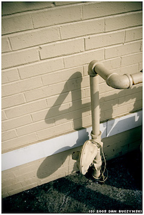

## This could be the start of something

Originally published 10-03-2008

{.left} Little and often has such appeal. Write 500 words a day and you'll have a decent sized book, with revisions, in under a year. With weekends off. Scan 10 slides an evening and before you know it those giant boxes of unsorted images are sitting up on Flickr just itching to be ignored. But life gets in the way. Always. Miss just one day and you're done for. This time it is going to be different, not least because I refuse to announce my intentions. [Blue Girl knows](https://web.archive.org/web/20080315090919/http://bluegirlredstate.typepad.com/blue_girl/2008/03/no-time-like-th.html). And maybe [OOC](http://oocradio.blogspot.com/2008/01/50-100-50-challenge-post-1-of-50.html), whose friend is a contraction. Not me.

Flickr photograph by [horizontal.integra tion](http://flickr.com/photos/ebolasmallpox/2179047732/)

## Iatrogenic infection

Originally published 11-03-2008

{.left} This thing I have undertaken, it isn't really a meme. Nobody tagged me. I infected myself. And I'm still not sure why. Possibly because I know that I have been neglecting this blog of late. So what? Well, I don't feel good about that. Not because I feel a duty to you, loyal reader, but because I am letting myself down. I've written all I can for the day, I say. But that cannot be true. And so, preferably without cheating and stacking things up, I plan to write something every day. Until I'm cured.

Flickr photograph by [mittens oh my!](http://www.flickr.com/photos/mittensohmy/56181603/)

## Wanted: technofix

Originally published 12-03-2008

{.left} It is folly to imagine that a thing -- high-tech, low-tech -- is going to solve my problem. But still the [nostalgia for an input device](http://jeremycherfas.net/2005/10/26/back-to-the-future-again/) tugs. [^2] Don't get me wrong. I love my notebook and pen to bits. But that isn't an input device. I've toyed with the idea of snapping or scanning pages and uploading them as is, but that's way too much of a faff, even from a phone. The kind of thing I want is full-size qwerty, smallish screen, basic TXT files and bluetooth. Neo uses wires, Dana [^1] has no bluetooth. Anything else?

[^1]: Both now apparently dead.

[^2]: Link coming soon.

Flickr photograph by [JaulaDeArdilla](http://flickr.com/photos/jauladeardilla/2296199471/).

## Cool running

Originally published 13-03-2008

{.left} The first time it happened I was unprepared. We were out walking early, me and the dog, when she came up behind us silent as a submarine. Then she was past, veil flapping softly. Not dressed athletically. Aside from the veil [^fn1], the regulation dark anorak, blue skirt, black socks, black tights. (They couldn't possibly be stockings, could they?) And some sisters coming on behind, a couple less athletic than the others. Late for some specific prayer? _Mens sana in corpore sano_? There was no way to tell. Or maybe there was. I made it a bit of a mission.

Flickr photograph by [macwagen](http://flickr.com/photos/macwagen/5996001/).

[^fn1]: This bit doesn't count, but there'll be more on this topic in future.

##Nun the wiser

Originally published 14-03-2008

{.left} The next time it happened, I wasn't quite so surprised. It had been a Thursday. Now it was Tuesday. Roughly the same time, and there they were again; veils flapping, anoraks, running down the street. Theories began to form. Same time. Every day? Or every other day? No information on that one. Probably not late for something, not on two separate occasions, not all of them. It occurred to me that I might not be believed, so two days later, on Thursday a week ago, I confess I loitered on the corner with my camera. Nuns run. For fun?

Flickr photograph by [Kentigem](http://flickr.com/photos/kentigern/223140452/).