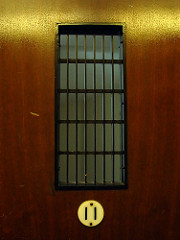
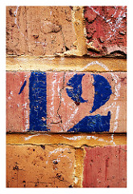
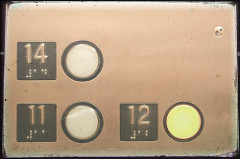

## Not quite a habit

Originally published 20-03-2008

{.left} Blue Girl asked: "Have you created your new habit yet?" And the truth is, "No, not quite". I was very tempted to skip today; late, tired, I could always backdate it tomorrow morning.  A real habit would not have allowed that. And to be honest, if I hadn't taken the precaution of preloading a few entries with their numbers (my hair shirt is scratchier than yours, as I told Blue Girl elsewhere), I know I would have skipped. Would it be cheating to line up, say, one post for emergency use? Probably not, and I will explain why tomorrow.

Flickr photograph by [renedepaula](http://flickr.com/photos/renedepaula/266259713/).

## Just in case

Originally published 21-03-2008

{.left} I used to write a column, every fortnight, from an ex-Commonwealth country for a London-based magazine. Pre-email. Fax difficult. Copy delivered airmail. One day my editor called.

"Where's your copy?"

"I sent it a week ago."

"It hasn't arrived."

"Bugger. OK, I'll give it to a copy-taker. Is there someone free?"

"In a minute. But before that, I suppose we ought to have a spare on hand."

"Yes."

So I wrote two pieces that fortnight, one timely, as ever, one less so, and we rotated out the spare every three months or so.

Flickr photograph by [Khya](http://flickr.com/photos/khya/64534096/).

## Thirteen

Originally published 22-03-2008

{.left} While I'm not above stealing content occasionally, if I feel it is necessary, so many people have released their work with some form of [Creative Commons](http://creativecommons.org/) license that there really is no need. What's more, the quality is often astonishing. It's also often truly appalling. The same is true of copyrighted material. Which figures. Adding the numbers to these posts has required little more than [going and looking](http://flickr.com/creativecommons/by-nc-nd-2.0/) for numbers. And I found them, and it is enormous fun looking. As for the superstition angle, seventeen is the one to avoid here. How do you explain that?

Flickr photograph by [TW Collins](http://flickr.com/photos/twcollins/1253350853/).

## Unexpected pleasures

Originally published 23-03-2008

{.left} It has been windy and raining for three days, on and off, mostly on. We went to a friend in the countryside and spent the time indoors reading by the fire. Last night, in a momentary break, I took the dog out, and my jaw dropped. Big black clouds were sailing in stately manner past the brightest full moon I can remember in a long time. Cloud rims shone silver, their interiors blacker than the night, and from time to time the moon broke brilliantly free.

Back home, the wind had blown one of the two lemons from the tree.

Flickr photograph by Cold Cut, but it isn't there any more.

## Lousy weather, perfect day

Originally published 24-03-2008

{.left} From the morning's round with the dog, when we marveled at the big trees brought down in the Villa Sciara, to the evening's leek and potato soup with fresh-baked bread, it has been a fine day. It's always nice not to have to go to work, but even better when there isn't anything all that pressing to do at home. A bit of cooking, a bit of blogging, a bit of wandering the byways of the intertubes. I always think I could be reasonably happy if that were how most days went, but possibly not.

Flickr photograph by [Jon Kneller](http://flickr.com/photos/morocco/87056157/).