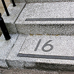
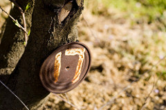
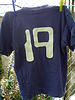

## Rats! Another Big Idea

Originally published 25-03-2008

{.left} I had A Big Idea yesterday. This is bad because it reminds me of my deficiencies. I am not a risk-taker. I've never second-mortgaged the house to invest in a dream of riches. I'm lazy, seldom managing to avoid the lure of a nap. I'd rather be with someone than working a lonely furrow on into the dawn. And I like to be comfortable, in a warm, dry abode with decent furniture and good things. My past is littered with Good Ideas. This time, I've placed a help wanted ad. No replies just yet.

Flickr photograph by [Kentigern](http://flickr.com/photos/kentigern/305750775/).

## Melancholia? I don't think so

Originally published 26-03-2008

{.left}"You seem melancholy," she said.  
"Really? I don't feel it."  
"No, not you right now, your blog. It seems sad. And what's all that about giving and happiness?"  
"I think I know what you mean. But I don't think it's melancholy."  
"You seem to want something, to be ... missing something?" With that rising question mark intonation.  
"Maybe you're right. Maybe I just want to get some satisfaction from the things I have to do, rather than just from the things I do in between the things I have to do."  
We left it at that.

Flickr photograph by [nhanusek](http://flickr.com/photos/nhanusek/421213633/).

## Balls in the air

Originally published 27-03-2008

{.left} Enough with the melancholia accusations. This morning's [TedTalk](http://www.ted.com/speakers/view/id/198) put me in an entirely different frame of mind. Juggling! I love juggling. The Raspyni Brothers are [so web 2.0!](https://web.archive.org/web/20120418064629/http://www.raspynibrothers.com/blog/)[^1] and funny with it. The best I've ever seen live were the Gandinis, ages ago at the Edinburgh Festival. The very notion of slo-mo juggling, the objects (pop bottles, IIRC) never actually been thrown blew me away. [They've moved on too](http://www.gandinijuggling.com/): just watch [this](http://www.youtube.com/watch?v=8MfJVROQy8Q). I should have used a still with 18 clubs in the air as my image today. But what's with the Italian names?

Flickr photograph was by [SpacePotato](http://flickr.com/photos/spacepotato/708561568/).

[^1]: Or, were. Site is dead. [But rises again](http://www.raspyni.com/)

## A minefield

Originally published 28-03-2008

{.left} The average academic-style seminar is a tar-pit for the unwary. The questions are fraught with baggage and meaning. I'm smarter than you are, and that's why I'm asking this question. I'm thick as pigshit [^fn1] and I don't even know it, and that's why I'm asking this question. I know why you're asking that question, and that's why I'm going to do my best to avoid answering it. My question's sub-text on a minor detour was "how can you possibly think that?" But I let it slide.

Flickr photograph by [Mouse](http://flickr.com/photos/mouse/3186170/).

[^fn1]: Why do we say this? In my experience, pigshit is generally on the runny side, not at all thick.

##How it started

Originally published 29-03-2008

{.left} There's a struggle each morning. Walkers and cars, each trying to dominate the other. It probably started when Romulus told Remus not to jump over his wall.

"Stuff that, I'll jump over anything I like."  
"Right. Then I'll have to kill you."

There's just no respect. Drivers disrespect pedestrians. Pedestrians disrepect drivers. The result really is a doggy dog world, and yet nobody seems to see anything wrong with that. That's how we are, they say, as if there were no possibility of being any other way. Density-dependent selection aside, it drives me nuts.

Photograph by me!
