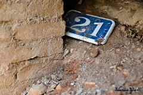
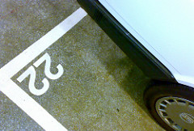
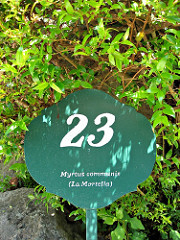
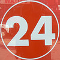
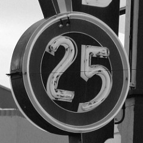

## Which way?

Originally published 30-03-2008

{.left} "We'll be leaving in a moment. Especially if you can tell me the route."

I thought the bus driver was joking, an attempt to break the ice with his sole passenger early on Sunday morning. But no. He hesitated at a crossroads.

"Turn left," I yelled.

More people were getting on, and when he attempted to go straight through the lights there was a general outcry. And the car behind wouldn't reverse. A woman took up the challenge of keeping the driver on the straight and narrow. Where else would a bus driver rely on passengers to know the route?

Flickr photograph by [sebastian.yepes.in 's](http://flickr.com/photos/sebastian_yepes/1472536055/)

## Some days

Originally published 31-03-2008

{.left} Some days, and I confess with pride that this is the first since I took my original tentative steps on this road to writing redemption, are so utterly bereft of publicly usable incident and inspiration that it fair boggles the imagination, looking back across the empty wasteland, to conceive of how it is that, forced to rely on mere reflex to drive the mechanism of the body, one emerges at the other end not only intact and with all senses functioning more or less at their customary level, but also, and this is the really unbelievable part, a dollar richer.

Flickr photograph by [nettsu](http://flickr.com/photos/nettsu/2267071797/).

## Things did happen

Originally published 01-04-2008

{.left} I was fibbing when I said that nothing happened yesterday. There was a whole heap of stuff, but many things are best left unblogged. So lets focus again on the unbelievable self-centredness of the average Italian behind the wheel of a car.

Works are taking place on the road to the station. The pavement is blocked for about 30 metres. Rather than crossing the road, I choose to walk close to the bright orange mesh. This morning a car's wing mirror clipped me as it went past, apparently unable to slow down for even a couple of seconds.

Flickr photograph by [me](http://flickr.com/photos/jcherfas/sets/72057594130178252/).

## Some other days

Originally published 02-04-2008

{.left} Hot date planned. First I was late out of my meeting. Then the late train was cancelled. I sent an SMS. Very late home, the dog unwalked, phone low on juice. Plugged it in. Dialled her number. and from the next room came that irritating tune. Phoned where she'd been, discovered she'd popped out to look for me, said if she came back I'd be down as soon as I could. Marched on down, dog in tow, and all was just fine. So we had a Campari in the piazza, ate and walked home. Hot date: accomplished.

Flickr photograph by [Claudecf](http://flickr.com/photos/bip/419968368/), who subsequently disabled downloading. No idea where I stand now.

## Truth and beauty

Originally published 04-04-2008

{.left} It was a brief tussle. The sinister little red guy said, "Fake it." The putti on duty [^fn1] chorused "Who would you be fooling?" And the putti won.

Two unforeseen social engagements yesterday conspired to deliver much merriment but no time to write. Hence the brief tussle. I could have faked it, and while I didn't make up the rules there's no actual punishment for breaking them. So I'm going with truth, at least this time. And a new rule. If I truly cannot, as opposed to will not, I don't have to.

Flickr photograph by [kpishdad!](http://flickr.com/photos/wiphey/80420065/)

[^fn1]: The Squeeze's coinage.