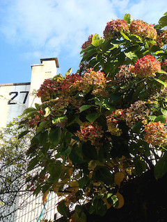

## Action!

Originally published 05-04-2008

{.left}
 At a meeting yesterday morning we discussed a shared workspace. The Chair preferred email, "because people prefer action items, and an email in your inbox you can take action on. Going to a shared workspace you can ignore."

Well yes, if it weren't that so many of the emails in one's inbox required no action, except to press delete. FYIs, keeping you in the loops, protecting my arses, reply to alls, pure spams. They're all in there, swamping the few that can and do require action.

I thought it better not to recommend RSS feeds and alerts.

Flickr photograph by [Shyha](http://flickr.com/photos/shyha/1260984431/).

## No instant pleasure

Originally published 06-04-1008

{.left} Even though I conduct all my gardening these days in silly little pots, I'm aware of how much I like the anticipation. A big blooming bush is instant bliss, but often leads to heartbreak as the plant struggles to cope with conditions outside the pampered nursery environment. Going out every morning to check on newly emerged leaves, or waiting for a shoot to poke its head above the compost, is a slower pleasure but, in the end, a more satisfying one. Watching a plant grow and change is a big part of what I like. Even in little pots.

Flickr photograph by [gracias!](http://flickr.com/photos/ms_gracias/302885171/)

## Specialists

Originally published 07-04-2008

{.left} On Flickr, as elsewhere, there are specialists. I've come to recognize a few who specialize in numbers, and in my hairshirt search for illustrations for this series I have sometimes chosen a lesser image rather than take yet another from one of them. But specialization often increases ability, and there's a fine line to be drawn between the fresh approach of a non-specialist and the guaranteed good, but possibly not superb, offerings of a non-specialist. There's a lesson there for all walks of life, I believe, to which I definitely need to pay more attention.

Fickr photograph by [Mouse](http://flickr.com/photos/mouse/4932890/).

## Good news, everyone!

Originally published 08-04-2008

_This post is number 29 in [a series](https://www.jeremycherfas.net/blog/tag:50%20x%20100%20x%2050)._

{.left} [Good news, everyone!](http://en.wikipedia.org/wiki/Hubert_J._Farnsworth) I managed to upgrade WordPress entirely painlessly. Smooth. Flawless. A dream come true. Except (you knew that was coming) that I can no longer upload pictures to my posts. Dunno why. Voodoo. WordPress admits it's a problem, and I spent much of last night trying everything possible to fix it. But there it is. Flickr, weirdly, now tells me that posts to the blog work, and they do, whereas before it said that the post had failed, but it hadn't. For now, I'll add a little rubric and maybe come back for images later. [^1]

[^1]: _So I did, making use of the [nifty flickr search and attribute tool](http://johnjohnston.info/fcc/) by John Johnston._

## Busy being busy

Originally published 09-04-2008

_This post is number 30 in [a series](https://www.jeremycherfas.net/blog/tag:50%20x%20100%20x%2050)._

{.left} Racing around a bit at the moment, I pause to reflect that there is something energizing about simply having too much to do. I've gained an hour through the wonders of travel, and thus will manage to get this post in before the midnight deadline, and managed to accomplish a bunch of other stuff as well. Of course, most of that falls into the "best left unblogged" category. But how tawdry would it have been to have blogged about the mouthy woman on the crowded bus, who needed to share her entire content-free conversation with us all? Tomorrow.
