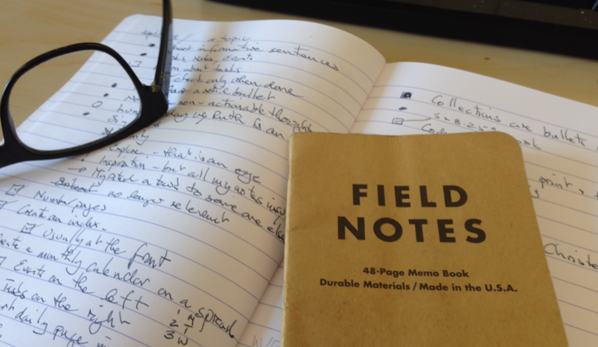

{.center}

Some very smart people have been having a right old ding-dong over how big a phone is and how small a tablet is and this mythical creature called a phablet. Little of which I can relate to, as I don't have a tablet and my phone is a fine size for me. But I certainly can relate more generally.

===

I've always liked pen and paper as my main form of outboard memory. One reason is that, while I have nothing like a photographic memory, I do have a kind of visual memory that tells me that the information I'm looking for was written in blue ink on the page with a coffee stain. Another is that I find the physical act of writing something down helps to preserve it in a way that, say, typing does not. Also, while it *can* become geeky in the extreme, it doesn't have to be, and in most social circumstances is far less geeky than anything electronic. [^1]

 {.left} To get back to phones and tablets, I've also always had two form factors for my paper. The phone used to be, and sometimes still is, a stack of index cards, although now it is more often a small (9x14 cm) notebook. The tablet is an A5 bound notebook, Clairefontaine for preference when I can find them. And while there are people who manage to carry an even bigger tablet around with them most of the time, I don't except when I have a bag of some sort. When I do, though, I like having the tablet with me. And when I don't, I sometimes forget to transfer from the phone to the tablet. 

All of which is of supremely little general interest, I'm sure, as is the fact that I've decided to try and give the [Bullet Journal](http://www.bulletjournal.com/) approach a try. So far, I like it as a good and useful combination of task list and journal. But it does need a tablet, not a phone.

[^1]:Having said which, I did at one time try to develop the habit of using my phone to record very brief memory-jogging audio notes. That's good on the go, but I need to somehow make it a lot easier.