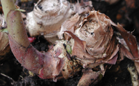

 {.left} Another perfect Saturday, sunshine and blue skies. A clarion call to the garden centre and the terrace. On the way to the garden centre I was distracted by the need to do weekly shopping at the supermarket where, Lo!, two-year-old olive trees were on sale at 5.90 each. So I bought two. Then to the garden centre for pots and compost. At home, half an hour of serious work was needed to get the mother of all gingers out of her pot. And to think that just two years ago it was a single shoot on a little knob of ginger, kindly donated by Silvana. Now it was a monstrous tangled miracle of secret growth. And tasty too. So that got split up and replanted, with a little held back as a harvest. Huge satisfaction also as a result of discovering 13 vine weevil grubs and dropping them down the drain.

Then on to the lemongrass, looking very sad and tattered after a winter of high winds and low temperatures. Again, the miracle is simply how a little shoot turns into a mass of lemongrass. And how simply trimming the dead leaves off and cutting back the roots turns each stalk into a thing of special beauty. Potted on a bunch more of those too, for next year. And the same with the cannas.

Now I know cannas are edible too, but I'm not equipped to extract the starch from them. However, there is something absurdly gratifying about harvesting one's own produce. Even though one has done so little to deserve it. Neither ginger nor lemongrass are exactly demanding. They just grow. And that suit me fine. It suits me too that I can pot them up and give them to others, just as they were given to me.