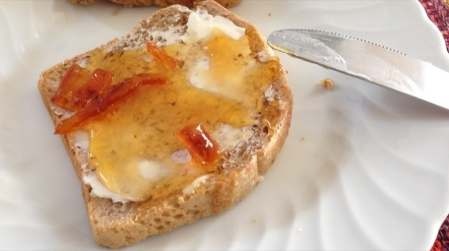

 {.center}

Last Friday night, walking the dog, the sight of oranges mouldering on the ground, mushed in puddles, abandoned in the mud, upset me. I filled my pockets with fruit from the trees that line one of the paths under the Villa Doria Pamphilij, finished the walk, and plunged headlong into a search for marmalade recipes.

It soon became clear that there are two schools of thought. One boils the fruit first, then scoops out the pith and pulp and shreds the peel. The other squeezes the fruit and shreds the raw peel, allowing it to soak overnight. But which is better? [Saint Delia](http://www.deliaonline.com/recipes/cuisine/european/english/traditional-seville-orange-marmalade.html)[^1] shreds first. [Jane Grigson](https://britishfoodhistory.wordpress.com/2013/01/14/seville-oranges-and-seville-orange-marmalade/), always reliable, boils first. Nobody seems to offer any reason why one should be preferred over the other. I went with Jane.

One surprise was the amount of sugar. Double the weight of the fruit, although not entirely surprising given how bitter -- sour really is too effete a name -- these oranges are. The other is how easy the whole thing is. There were a couple of dodgy moments. One when I realised that despite the rolling boil, peel had stuck to the bottom of the pan and was burning nicely. When I dislodged it there was an almighty whoosh of boiling marmalade, and I was very glad I had chosen to go with the deeper stockpot, which seemed excessive at the start. 

 {.left} The other surprise, somewhat pleasanter, was just how much of the stuff there seemed to be; far more than I had jars for. A quick trip to the local market saw me come home with 6 new jars, with lids, and continuing gratitude that this is the sort of thing one can still do almost anywhere in Rome. Bottling is less fraught than with most jam, too, because all the recipes advise allowing the marmalade to cool in the pan for a good 20 minutes or so. This apparently prevents all the peel floating to the top or sinking to the bottom. So there was none of the fear induced by handling near-boiling sugar syrup, and the final result was a mini-mountain of fine marmalade.

 {.center} 

Another, unanticipated result, was the dicovery that my mind really is a lot more rutted than I thought it was. I had already used my [oh-so-clever title for this post](../oranges-are-the-only-fruit/), back when this blog was young.

[^1]: Link updated 25 December 2015 