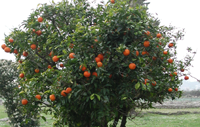

To Sorrento for a couple of days, to catch up with dear friends who are visiting for a week. The kinds of friends with whom one just takes off where one left off, despite not having had much serious contact for a year or more. About Sorrento and the Amalfi coast, least said soonest mended. I mean, there's no doubt that it is a fine rugged landscape. But it isn't that fine. And given how clogged the coast road was on a bleak February day, it must be Hell on Wheels at the height of summer.

 {.left} As for the oranges, that part **is** wondrous. To see the orchards, with their elaborate but somewhat ramshackle scaffolding of split spars holding up the trees and the frost-protective netting, clinging to the hillsides, is a genuine eye-opener. One wonders, of course, how and why people laboured as hard as they must have to create the terraces. And to an english eye there's something very strange about orange trees in fruit. The colour is too screamingly bright. They look artificial, as if someone had come along and hung them with oranges. The lemons are a little better, I think, but I don't think I will ever get used to the sight of orange trees.

On Day Two we ventured to Paestum, which is also truly wonderful, and raises the same questions of how and why the people who built it laboured as hard as they must have. The guidebook says the three Greek temples there are the best preserved in the world, and perhaps they are. It was wonderful to wander around the site, which was almost deserted, with the dog going crazy and conversation veering from the Didactic to the Trivial and back again at breakneck speed.

On a technical and geeky note, I've been prompted to faff about in Tinderbox in order to create some sort of image gallery. Or maybe I'll do it with iDisk. In any case, watch for changes. I also need to think about how I might separate geekishness from glory, as soon as Bobo had delivered two icons that will identify each. (25 December 2015: All now completely irrelevant. Though they were fine icons. I should maybe dig them up.)