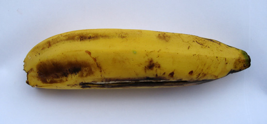

 {.center} 

I have tasted the past, and it was good. Hard to describe, of course; I'm not very good at that sort of thing. But in a word, more banana-y. At breakfast this morning, I took a banana with some other bits of fruit. The Boss, a top banana, piped up "You know that's a Gros Michel you've got there?"

"No, I didn't" I squeaked back.

===

"Oh yes," he replied casually, knowing he had me hooked. "What do you think?"

To explain, Gros Michel is the fabled banana of old, the one that dominated world trade until the current champ, Cavendish, replaced it in the 1960s. Gros Michel was wiped out by a disease that Cavendish is resistant to. Old hands speak of Gros Michel wistfully, that it was a far superior banana in all ways. For one thing It didn't bruise as easily, and so was transported as whole bunches. It was Cavendish that made banana boxes, which protected the single hands, necessary. Where would generations of street traders be without their banana boxes? But I digress.

Cavendish is now threatened by other diseases and faces the same dire future as Gros Michel; extinction. But when people (like the Top Banana) talk about Cavendish following Gros Michel into extinction they mean it in the same way as the blue whale is extinct; not commercially viable. Just as there are still some blue whales left in the oceans, so too there are places where Gros Michel is still grown, and Uganda, where it is known as Bugoya,  is one of them. And that is how I was able to taste a Gros Michel at my first breakfast here.

Like I said, it has more of that banana taste than a Cavendish. Maybe a little sweeter too, and I think the flesh was softer. Not like the tiny little bananas, some of which taste of lemon, that are my only other reference point for bananas. Given a choice, I think I'd rather have Gros Michel than Cavendish on my supermarket shelves.

I don't really have that choice, of course; I buy what the suppliers offer, and that will be Cavendish until it eventually does succumb to the disease and go (commercially) extinct. No problem. The people here in Uganda face real problems, because for them banana is the main staple. The same word -- matooke -- means banana and food. And their favoured varieties are also susceptible to these new diseases. For them, the extinction of a variety could indeed mean starvation. I'm meeting some of them tomorrow, and hoping to find out not only how they are being helped to use better management and banana biodiversity to manage the threat of diseases, but also how they are diversifying their own enterprises to capture more of the value of bananas. That may involve a taste of banana beer or banana wine.
