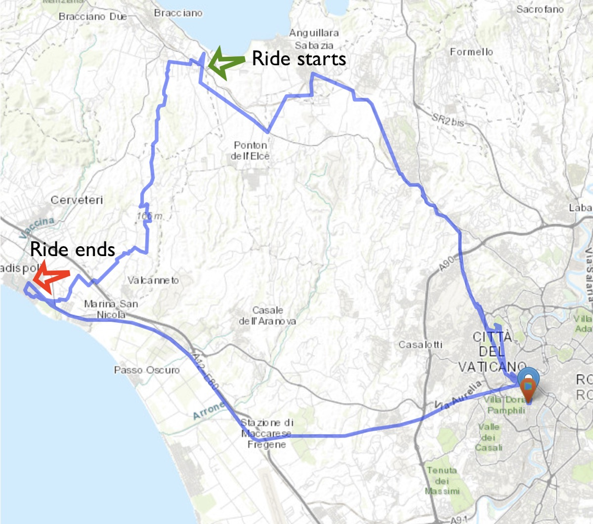
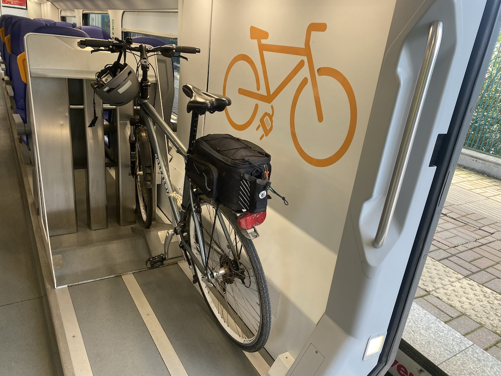
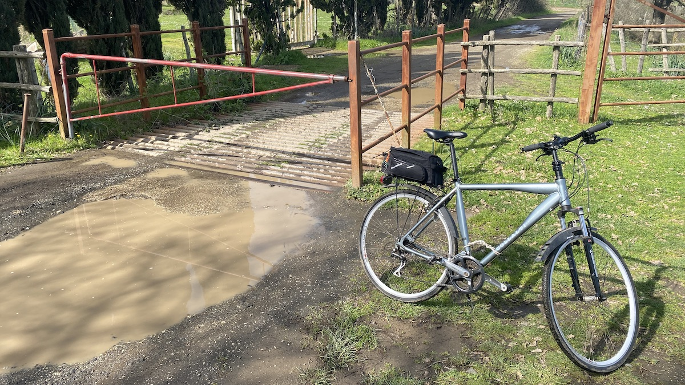
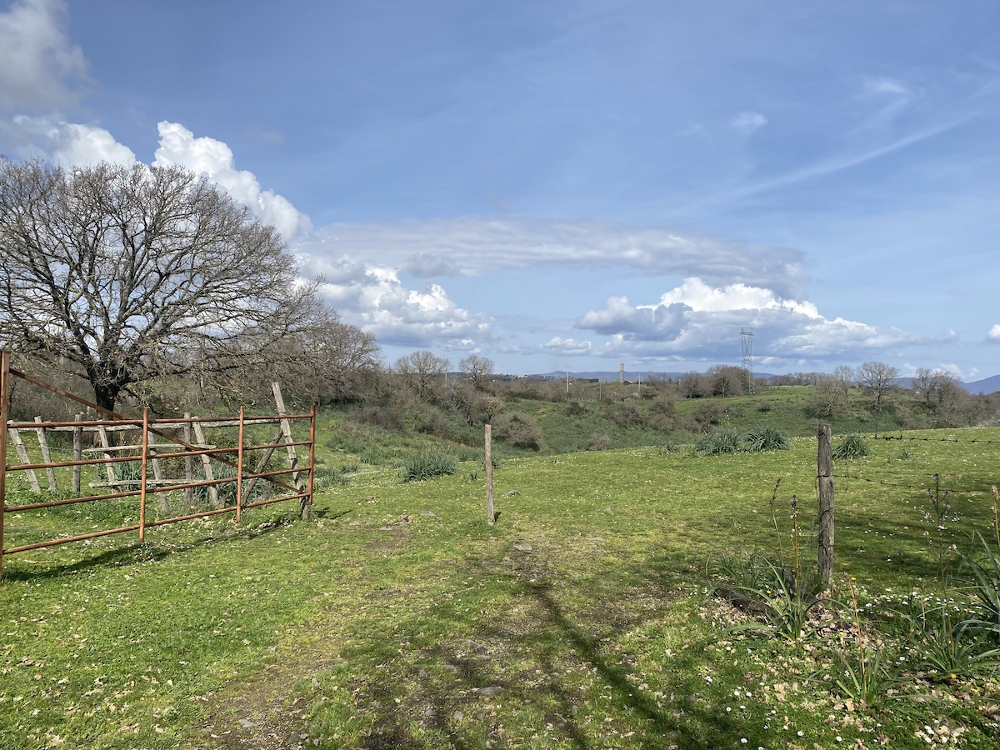
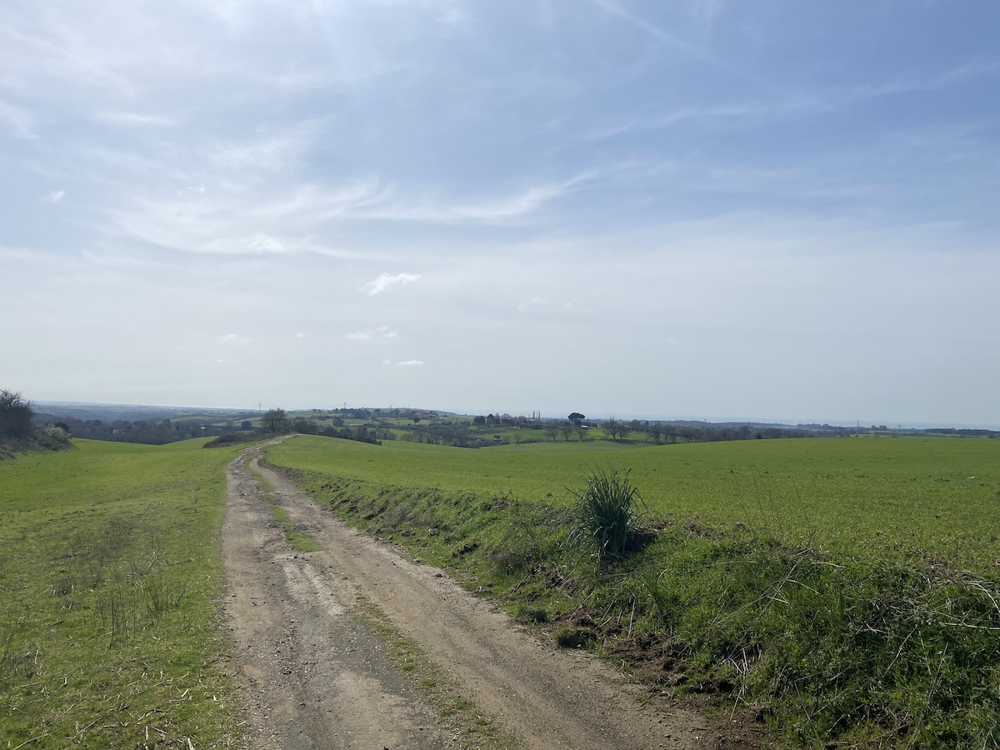
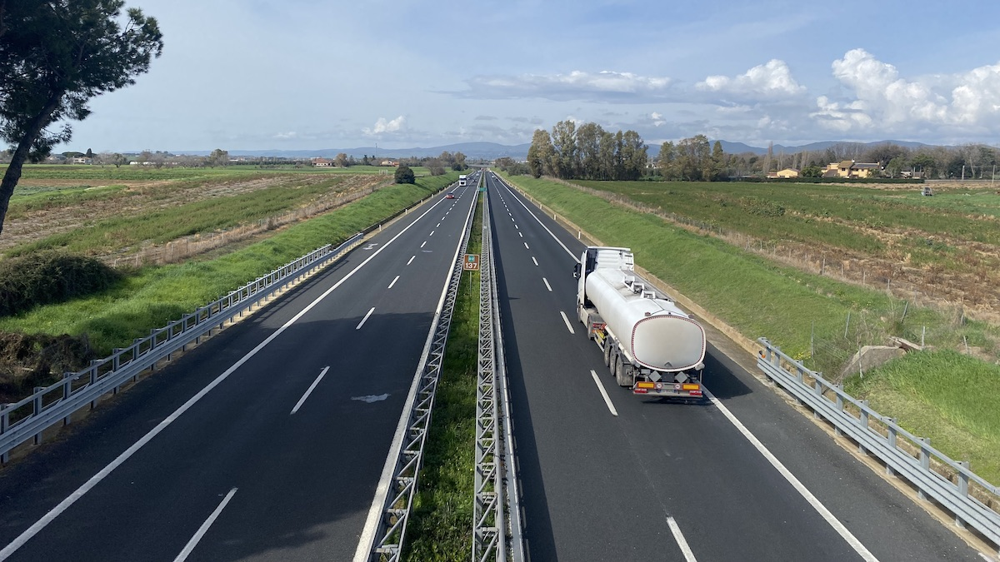
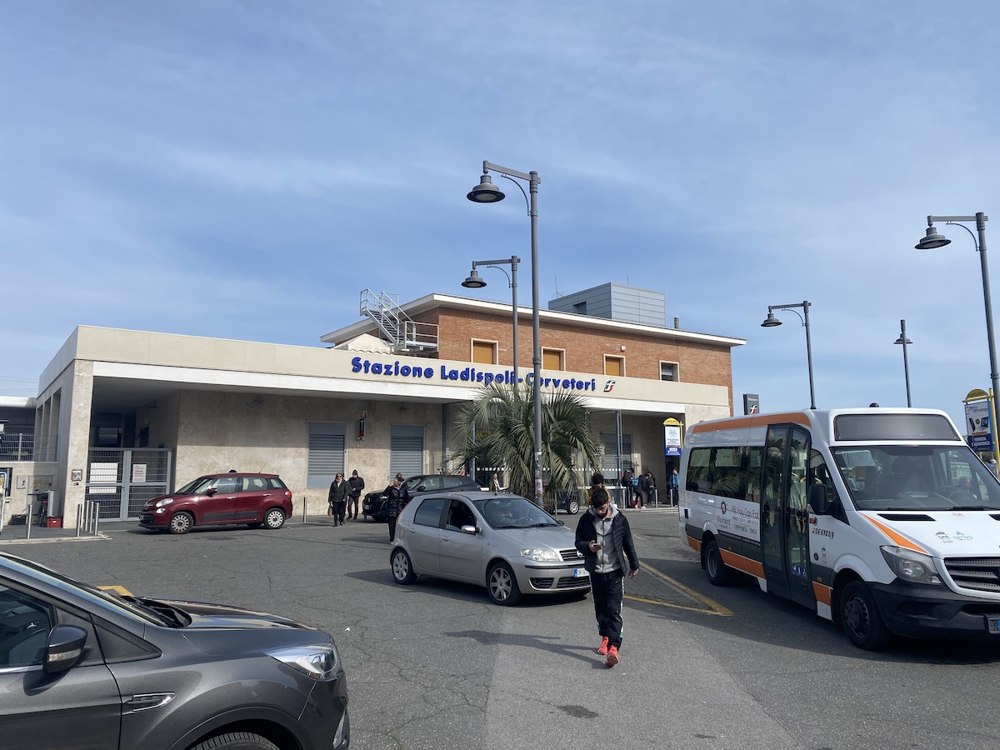

A couple of days ago I took myself off for a multi-modal adventure. Bike to the station, train to the countryside, bike to another station, train back to the city, bike home.

===

{.center}

This all happened because last week on Mastodon someone mentioned the bicycle map at [cyclosm](https://www.cyclosm.org/#map=12/42.0164/12.1591/cyclosm), which immediately looked more attractive to me than OpenCycleMap. Poking around in our general location I noticed a nice brown and blue line running down from Bracciano lake to Ladispoli on the coast. The key isn’t super helpful; blue seems to be “path designated for bicycles” but brown wasn’t obviously anything special. Looking at the map, though, and knowing the area a bit, the route seemed to be mostly off-road and downhill all the way. And it is only about 30km, so no need for any preparation.

Tuesday’s weather looked good, so off I went, zooming down the hill to St Peter’s station. The one-way train fare is €3 and a bicycle ticket another €3 for the whole day. Carriages with bicycle facilities are clearly marked, and those facilities consist of three slots in which to park your bike. Unfortunately there didn’t seem to be any way to secure the bicycle against the swaying of the train, so I just stood there with my back to the bicycle.

{.center}

The train journey is pleasant enough, less than an hour and with lots of stops along the way. Once at Vigna di Valle station I was obliged to carry the bike through the tunnel under the track and up onto the side of the road. At this point, looking at the map from the comfort of my desk, I should have gone away from the (not very busy) main road to join the route, but in the bright sunshine and my eagerness to get going, I took the main road instead. Not a big problem.

{.center}

From there it was all reasonably plain sailing. There were stretches of very bad surface; eroded earth, distressed paving, mud. I had to open and shut cattle gates a couple of times. At one point quite a few big Maremma sheepdogs viewed me as a threat and did their best to turn me away. That’s always a bit scary, but in the end, pedaling steadily, I managed to leave their territory without coming to any harm. There were some lovely open views, sections through woodland and through bright green spring wheat. Exhilarating downhills and tedious climbs, despite the overall descent. A single yellow butterfly. 

{.center}

{.center}

Near the end we crossed over the main motorway in that area, the A12. I always like bridges over busy roads. It somehow enhances my sense of being apart.

{.center}

A little further on quiet roads through the town of Ladispoli to the train station, about 28km in all at an average speed of 15.1kph. There was time for a couple of slices of pizza for lunch before catching the train back and the awful climb back home. Definitely a good excursion, definitely worth repeating and building on.

{.center}

## Improvements
The biggest problem on solo rides of this kind is navigation. I use OsmAnd Maps on my iPhone and it is OK, but it isn’t brilliant. I rely on the app’s built in route-finder, which is not necessarily coordinating with the route I have seen in CycleOSM. I would really like an easy way to download a route, maybe one created and shared by someone else, and have that give me the turn-by-turns. I know there are ways of doing that, but I have not tried any of them. I hear good things about [Komoot](https://www.komoot.com). 