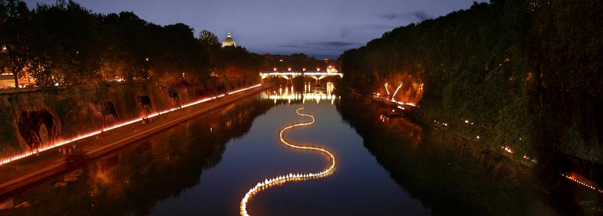

Down to the river last night for the third annual [Tevereterno]~~http://tevereterno.it/tevereterno.html~~ binge to mark the solstice. Maybe I’m getting jaded, but last night was actually a bit disappointing, I’m afraid. There was a passel of marimba, xylophone, vibraphone type players doing a minimalist, rhythmic, repetitive kind of thing, which was rather good to listen to but a little too loud for those of us who were actually strolling down by the river. In between times some fascinating ambient-type music, somewhat reminiscent of whale song but also full of other sounds too. There were the by now customary thousands of candles flickering beautifully along the edge and reflected in the water. And it was fun to meet lots of friends in the intense heavy humidity and chat about art, life and sundry other stuff. But the main attraction, a rumoured river of fire snaking its way down the Tiber, had failed to materialize by midnight, so I bailed.

{.center}

Maybe it did look like the photo above, courtesy of a [Press Release](http://www.scoop.co.nz/stories/CU0706/S00222.htm). I hope so, and I’m sorry I missed it, and I know sleep is for losers, but etc. etc.

The really bad news, of course, is that winter is now on its inexorable way.

!!! 2022-07-28: The even worse news, actually, is how little documentation remains publicly accessible of these publicly funded artworks. For shame.
