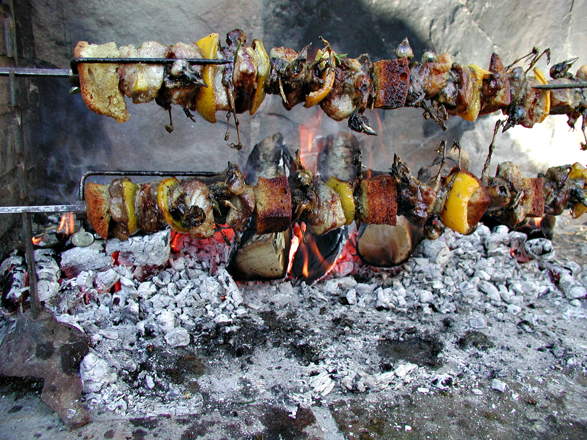

To the countryside once again, for another celebratory meal. And yes, this time, there were the fabled _ucellini_ -- little birds -- that many Italians wax lyrical about. A clockwork contraption gently rotated two spits in front of a bed of banked oak embers, each spit loaded with pieces of bread, squares of yellow pepper, and little birds. And though they looked somewhat macabre, they smelled divine, especially in the minutes after our host Leonardo basted them with a rosemary brush dipped in a mixture of olive oil, white wine, salt and pepper. (Some [pics on Flickr](https://www.flickr.com/photos/73529121@N00/tags/ucellini/).)

I wondered what kind of bird they might be, and was informed with a snatch of Beatles song that they were blackbirds. I was not convinced. The beaks, it seemed to me, were much too robust, heavy duty crackers rather than more delicate probers. I thought maybe bullfinches, but they seemed a little large for that.

What a time they took, though, to be done to a turn. At least three hours; I cannot be sure how much longer, because they were already roasting when we arrived. Finally, though, they arrived at the table, but not before we had already feasted on _gnocchi_ with _ragu_ and black kale sautéed with oil and hot peppers and served on toasted country bread.

I confess to being just a little ill at ease with the idea of scarfing a songbird, although I am not sure why. Perhaps it is because the finished product so resembles the animal that it is. A steak, after all, is not a cow. But a fish is a fish, and I eat those with gusto. Still, it isn’t every day one gets the opportunity, and so I tried one. The proper technique is to hold it by the beak and pop the entire scrumptious morsel into one's mouth, although even the smallest bird can be a bit of a mouthful, what with its long legs and somewhat scratchy little claws. A quick bite to sever the bird from its head, and then just chew. And chew. And chew.

It is a curious sensation, the crunchiness of the little bones eventually giving way to a mouthful of meat and then, strange to relate, a texture more reminiscent of a lump of overcooked liver than anything else. Good, I have to admit, very meaty, and with an added atavistic sensation of eating a traditional, yet now frowned upon, food.

I’m no connoisseur, obviously, but while they were good enough, it was hard to see what all the fuss was about. Probably _ucellini_ are as much a link to simpler times, to the countryside and its spirit of self-sufficiency that even the most urbane Italians identify with, as they are a delicacy in and of themselves.

The _gnocchi_, on the other hand, were something else again. Light as a feather, with a sweet taste of potato that perfectly set off the deep meatiness of the _ragu_. Sublime.
